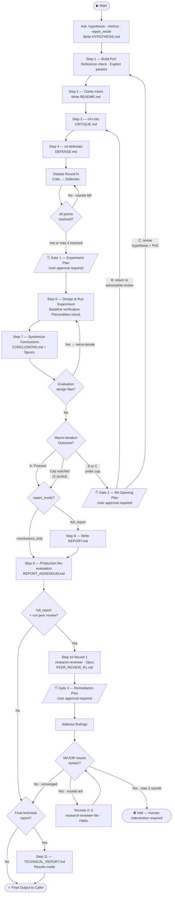

# ml-lab Canonical Flow

```mermaid
flowchart TD
    START(["▶ Start"]) --> PRE["Ask: hypothesis · metrics · report_mode\nWrite HYPOTHESIS.md"]

    PRE --> S1["Step 1 — Build PoC\nReference check · Explicit params"]
    S1 --> S2["Step 2 — Clarify Intent\nWrite README.md"]

    S2 --> S3["Step 3 — ml-critic\nCRITIQUE.md"]
    S3 --> S4["Step 4 — ml-defender\nDEFENSE.md"]
    S4 --> DROUND["Debate Round N\nCritic ↔ Defender"]
    DROUND --> DRES{"All points\nresolved?"}
    DRES -- "No · rounds left" --> DROUND
    DRES -- "Yes or max 4 reached" --> G1

    G1[/"✋ Gate 1 — Experiment Plan\nUser approval required"/]

    G1 --> S6["Step 6 — Design & Run Experiment\nBaseline verification · Precondition check"]
    S6 --> S7["Step 7 — Synthesize Conclusions\nCONCLUSIONS.md + figures"]
    S7 --> MFLAW{"Evaluation\ndesign flaw?"}
    MFLAW -- "Yes → micro-iterate" --> S6

    MFLAW -- "No" --> MACRO{"Macro-iteration\nOutcome?"}
    MACRO -- "A: Proceed" --> RPT_MODE
    MACRO -- "Cap reached\n(3 cycles)" --> RPT_MODE
    MACRO -- "B or C\nunder cap" --> G2

    G2[/"✋ Gate 2 — Re-Opening Plan\nUser approval required"/]
    G2 -- "B: return to\nadversarial review" --> S3
    G2 -- "C: revise\nhypothesis + PoC" --> S1

    RPT_MODE{"report_mode?"}
    RPT_MODE -- "full_report" --> S8["Step 8 — Write REPORT.md"]
    RPT_MODE -- "conclusions_only" --> S9
    S8 --> S9["Step 9 — Production Re-evaluation\nREPORT_ADDENDUM.md"]

    S9 --> PRGATE{"full_report\n+ run peer review?"}
    PRGATE -- "No" --> S11GATE
    PRGATE -- "Yes" --> R1["Step 10 Round 1\nresearch-reviewer · Opus\nPEER_REVIEW_R1.md"]
    R1 --> G3[/"✋ Gate 3 — Remediation Plan\nUser approval required"/]
    G3 --> FIX["Address findings"]
    FIX --> PRCHK{"MAJOR issues\nremain?"}
    PRCHK -- "No · converged" --> S11GATE
    PRCHK -- "Yes · rounds left" --> R23["Rounds 2–3\nresearch-reviewer-lite · Haiku"]
    R23 --> PRCHK
    PRCHK -- "Yes · max 3 rounds" --> HALT(["⛔ Halt — Human intervention required"])

    S11GATE{"Final technical\nreport?"}
    S11GATE -- "Yes" --> S11["Step 11 — TECHNICAL_REPORT.md\nResults mode"]
    S11GATE -- "No" --> DONE
    S11 --> DONE(["✓ Final Output to Caller"])
```
