# ml-lab

`ml-lab` is a Claude Code agent that runs structured ML hypothesis investigations using an adversarial debate between a Critic and a Defender subagent. It enforces rigor at every step — pre-specified metrics, multi-round debate, agreed experiments only — and produces a self-contained report with a production re-evaluation. The methodology has been empirically validated; see [Part 2](#part-2-the-experiment-behind-ml-lab) for results.

---

## Part 1: Using ml-lab

### Install

**Via plugin (recommended):**

```shell
/plugin marketplace add chris-santiago/ml-debate-lab
/plugin install claude-ml-lab@ml-debate-lab
```

This installs all six agent files to `~/.claude/agents/` automatically.

**Manual install:**

```bash
cp agents/ml-lab.md ~/.claude/agents/
cp agents/ml-critic.md ~/.claude/agents/
cp agents/ml-defender.md ~/.claude/agents/
cp agents/research-reviewer.md ~/.claude/agents/
cp agents/research-reviewer-lite.md ~/.claude/agents/
cp agents/readme-rewriter.md ~/.claude/agents/
```

Once installed, Claude Code will make `ml-lab` available as a spawnable agent. Invoke it by describing an ML hypothesis — it will ask you to sharpen it into a falsifiable claim before starting the investigation.

**Invoking:**

- **`/ml-lab`** — explicit slash command entry point
- **Natural language** — describe an ML hypothesis and Claude Code routes to ml-lab automatically via its description

---

### What ml-lab Does

`ml-lab` is a Claude Code subagent that runs a structured ML hypothesis investigation workflow: (1) sharpen the hypothesis into a falsifiable claim, (2) agree on metrics and pass criteria before any code runs, (3) build a minimal PoC, (4) adversarial critique, (5) point-by-point defense, (6) multi-round debate until each contested point resolves or both sides agree on an empirical test, (7) run only the agreed experiments, (8) evidence-informed re-critique if findings are surprising, (9) production re-evaluation against operational constraints, (10) optional peer review loop (`research-reviewer` + `research-reviewer-lite`), (11) optional final technical report in results mode. Steps 10–11 are user-confirmed — neither starts automatically.

The workflow is designed for rigor over speed. Given a hypothesis, `ml-lab` first sharpens it into a falsifiable claim with agreed metrics, then builds a minimal runnable PoC. From there it branches into two adversarial subagents with distinct mandates:

- **`ml-critic`** — a skeptical ML engineer with an applied mathematics background. It reads the hypothesis and PoC cold and identifies every implicit claim the code makes but hasn't tested, organized by root cause. It is explicitly forbidden from critiquing code style or features the PoC declared out of scope.
- **`ml-defender`** — the original designer, arguing that the implementation is sound. It reads the critique and responds point-by-point: concede, rebut, or mark as empirically open. Fast concession on a real problem is valued over protracted defense.

`ml-lab` then orchestrates a multi-round debate between them, alternating dispatches until each contested point resolves — either one side concedes, or both agree on an exact empirical test with pre-specified success and failure conditions. Only tests on that agreed list go into the experiment. If findings are surprising enough to falsify a debate assumption, the whole cycle reopens: `ml-critic` and `ml-defender` are dispatched again in evidence-informed mode, with experimental results in hand. The investigation closes with a self-contained report and a production re-evaluation that checks whether the experimental recommendation survives operational constraints.

---

### The Full Workflow

The diagram below shows the complete workflow, including user-approval gates and macro-iteration paths.

```mermaid
flowchart TD
    START(["▶ Start"]) --> PRE["Ask: hypothesis · metrics · report_mode<br/>Write HYPOTHESIS.md"]

    PRE --> S1["Step 1 — Build PoC<br/>Reference check · Explicit params"]
    S1 --> S2["Step 2 — Clarify Intent<br/>Write README.md"]

    S2 --> S3["Step 3 — ml-critic<br/>CRITIQUE.md"]
    S3 --> S4["Step 4 — ml-defender<br/>DEFENSE.md"]
    S4 --> DROUND["Debate Round N<br/>Critic ↔ Defender"]
    DROUND --> DRES{"All points<br/>resolved?"}
    DRES -- "No · rounds left" --> DROUND
    DRES -- "Yes or max 4 reached" --> G1

    G1[/"✋ Gate 1 — Experiment Plan<br/>User approval required"/]

    G1 --> S6["Step 6 — Design & Run Experiment<br/>Baseline verification · Precondition check"]
    S6 --> S7["Step 7 — Synthesize Conclusions<br/>CONCLUSIONS.md + figures"]
    S7 --> MFLAW{"Evaluation<br/>design flaw?"}
    MFLAW -- "Yes → micro-iterate" --> S6

    MFLAW -- "No" --> MACRO{"Macro-iteration<br/>Outcome?"}
    MACRO -- "A: Proceed" --> RPT_MODE
    MACRO -- "Cap reached<br/>(3 cycles)" --> RPT_MODE
    MACRO -- "B or C<br/>under cap" --> G2

    G2[/"✋ Gate 2 — Re-Opening Plan<br/>User approval required"/]
    G2 -- "B: return to<br/>adversarial review" --> S3
    G2 -- "C: revise<br/>hypothesis + PoC" --> S1

    RPT_MODE{"report_mode?"}
    RPT_MODE -- "full_report" --> S8["Step 8 — Write REPORT.md"]
    RPT_MODE -- "conclusions_only" --> S9
    S8 --> S9["Step 9 — Production Re-evaluation<br/>REPORT_ADDENDUM.md"]

    S9 --> PRGATE{"full_report<br/>+ run peer review?"}
    PRGATE -- "No" --> S11GATE
    PRGATE -- "Yes" --> R1["Step 10 Round 1<br/>research-reviewer · Opus<br/>PEER_REVIEW_R1.md"]
    R1 --> G3[/"✋ Gate 3 — Remediation Plan<br/>User approval required"/]
    G3 --> FIX["Address findings"]
    FIX --> PRCHK{"MAJOR issues<br/>remain?"}
    PRCHK -- "No · converged" --> S11GATE
    PRCHK -- "Yes · rounds left" --> R23["Rounds 2–3<br/>research-reviewer-lite · Haiku"]
    R23 --> PRCHK
    PRCHK -- "Yes · max 3 rounds" --> HALT(["⛔ Halt — Human intervention required"])

    S11GATE{"Final technical<br/>report?"}
    S11GATE -- "Yes" --> S11["Step 11 — TECHNICAL_REPORT.md<br/>Results mode"]
    S11GATE -- "No" --> S12GATE
    S11 --> S12GATE

    S12GATE{"full_report or<br/>TECHNICAL_REPORT<br/>produced?"}
    S12GATE -- "No" --> S13GATE
    S12GATE -- "Yes" --> S12["Step 12 — Artifact Coherence Audit<br/>6 cross-doc consistency checks<br/>Fix any inconsistency before exit"]
    S12 --> S13GATE

    S13GATE[/"❓ README readability review?<br/>User confirmation required"/]
    S13GATE -- "No" --> DONE
    S13GATE -- "Yes" --> S13["Step 13 — README Rewrite<br/>readme-rewriter · outside reader<br/>diagnose → outline → rewrite"]
    S13 --> DONE(["✓ Final Output to Caller"])
```



---

### How the Agents Interact

| File | Role | Spawned by |
|------|------|------------|
| `ml-lab.md` | Orchestrator — runs the full 12-step investigation | User / calling agent |
| `ml-critic.md` | Adversarial critic — finds flaws the PoC hasn't tested | `ml-lab` (Steps 3, 5) |
| `ml-defender.md` | Design defender — argues for the implementation, concedes valid points | `ml-lab` (Steps 4, 5) |
| `research-reviewer.md` | Deep peer reviewer — Opus-class structured review of REPORT.md | `ml-lab` (Step 10, Round 1) |
| `research-reviewer-lite.md` | Verification reviewer — Haiku-class follow-up review | `ml-lab` (Step 10, Rounds 2–3) |
| `readme-rewriter.md` | Outside-reader README rewriter — diagnoses and rewrites for external audiences | `ml-lab` (Step 13) |

All agents except `ml-lab` are subagents. They are never invoked directly — `ml-lab` dispatches them at the appropriate steps via the Claude Code Agent tool.

```
User hypothesis
      |
   [ml-lab]  ←——————————————— orchestrates all 12 core steps
      |
      +——— Steps 1-2:   builds PoC, reviews intent
      |
      +——— Step 3:      dispatches [ml-critic]          → CRITIQUE.md
      |
      +——— Step 4:      dispatches [ml-defender]        → DEFENSE.md
      |
      +——— Step 5:      alternates dispatches until contested points resolve → DEBATE.md
      |
      +——— Steps 6-7:   designs and runs experiment, synthesizes conclusions
      |
      +——— Macro-iteration: if results surprise, re-dispatches ml-critic and ml-defender
      |    in evidence-informed mode (Mode 3) with experimental results in hand
      |
      +——— Steps 8-9:   writes self-contained report, re-evaluates under production constraints
      |
      +——— Step 10:     dispatches [research-reviewer]      → PEER_REVIEW_R1.md  (Round 1, Opus)
      |                 dispatches [research-reviewer-lite] → PEER_REVIEW_R{N}.md (Rounds 2–3, Haiku)
      |
      +——— Step 11:     (optional) writes TECHNICAL_REPORT.md in results mode
      |
      +——— Step 12:     artifact coherence audit — cross-checks all documents for consistency
      |
      +——— Step 13:     (optional) dispatches [readme-rewriter] → rewrites README.md
```

The key architectural constraint is **sequenced dispatch**: `ml-critic` receives only the task materials and produces its critique independently. `ml-defender` then receives the critique and responds point-by-point — conceding, rebutting, or marking points as empirically open. Each agent's role mandate is what keeps the exchange honest, not context isolation.

---

### An Example Run

To validate that `ml-lab` correctly navigates the full iteration stack — not just the happy path — we ran it on a fraud detection hypothesis:

> *"An LSTM on ordered transaction category sequences outperforms a bag-of-categories baseline because fraud exhibits characteristic temporal patterns."*

The run exercised every major feature of the workflow.

**Setup.** Before any code, ml-lab asked for report mode (full report selected) and confirmed the primary metric (average precision, given 0.05 prevalence). It also checked whether there was a reference implementation to match — there wasn't, so all parameters were set explicitly in the PoC rather than inherited from framework defaults.

**Steps 1–5.** The PoC returned AP = 0.96 — strong-looking. The critic identified four issues; the defender conceded three and marked one as empirically open. One debate round resolved the contested point into a three-condition experiment design: ordered LSTM, count-vector LR, equalized-distribution LSTM.

**Gate 1.** Before any experiment ran, ml-lab surfaced a structured experiment plan: the three conditions with pre-specified verdicts, the conceded critique points to incorporate, and the precondition check — confirming the LSTM actually encoded sequential ordering rather than frequency signal before treating AP as meaningful. User approved.

**Steps 6–7.** The experiment returned mixed results: the randomized-phases test showed the critique was right (AP dropped from 0.96 to 0.68 — phase position was signal, not sequence structure). The ordered vs. bag-of-categories comparison went to the defense. Then Condition C returned AP = 1.00.

The near-perfect metrics suspicion trigger fired immediately. The precondition verification check also flagged: an AP of 1.00 implies the model could perfectly distinguish imposed ordering from random sequences — which may mean the precondition (LSTM encoding temporal fraud patterns) is trivially satisfied by a structural artifact rather than learned signal. The agent investigated, found that `sort()` was making sequences trivially detectable, and redesigned Condition C with soft-sort (Gaussian noise on ranks). The redesigned condition returned AP = 0.996 — still suspicious.

This is where the spec's escalation logic was put to the test. Rather than accepting the second result or spinning into more micro-iterations, the agent correctly identified that the equalized-distribution test is *fundamentally broken for synthetic data*: any imposed ordering is trivially distinguishable from random sequences because LSTMs detect sequential structure. This isn't a fixable design flaw — it's a hypothesis-level problem.

**Gate 2.** The Outcome C trigger fired — not a broken experiment design, but a wrong question. Before re-entering the loop, ml-lab surfaced a re-opening plan: what triggered it (AP = 0.996 on soft-sort — structural artifact, not learned signal), why Outcome C not B (the mechanism is falsified, not just underspecified), what the revised hypothesis would need to test, and which artifacts would be updated. User approved.

The hypothesis was reformulated:

> *"Fraud accounts exhibit a specific temporal signature (low-value test transactions → rapid category switching → high-value extraction) that is distinguishable from both random ordering and generic monotonic trends."*

**Steps 8–9.** The report and production re-evaluation followed from the reformulated hypothesis and experiment arc.

**Steps 10–11.** After Step 9 completed, ml-lab offered to run the peer review loop. After peer review, it offered to produce a final technical report in results mode — findings stated as established facts, limitations as structural properties of the synthetic data design, the reformulation arc explained by logical necessity rather than discovery narrative.

The most important result from this run isn't the fraud finding — it's that the spec handled the full escalation without any additional guidance: micro-iteration (fix Condition C), second micro-iteration (still broken), escalation to macro-iteration (hypothesis needs reformulation). The distinction between a fixable experimental flaw and a hypothesis-level problem was load-bearing, and the agent navigated it correctly.

Full trace and spec validation notes are in [`seq_fraud_experiment/TEST2_FINDINGS.md`](seq_fraud_experiment/TEST2_FINDINGS.md).

---

## Part 2: The Experiment Behind ml-lab

This project asks a simple question: **when an AI evaluates a piece of work, does it actually catch real problems?**

The context is ML research — model results, statistical claims, deployment decisions. These are exactly the situations where evaluation matters most and where confident-sounding-but-wrong answers are most dangerous.

Two things are distinct here: the **self-debate protocol** (the evaluation method — Critic, Defender, Judge) and **`ml-lab`** (the agent that *uses* that protocol as one step in a broader workflow). The experiment benchmarks the debate protocol directly. ml-lab is what packages it for real use.

The self-debate protocol was chosen as the domain for a specific reason: it's testable. Unlike most ML research questions, we can construct scenarios with known correct answers and measure whether the agent found the right one. This makes it possible to ask not just "did `ml-lab` follow the process?" but "did following the process actually produce correct verdicts?" The self-debate experiment is, in that sense, `ml-lab` investigating itself — the protocol is both the tool and the subject.

---

### The Setup

The system under test is a **self-debate protocol**: one agent plays Critic, one plays Defender, a Judge adjudicates. The key architectural choice is that Critic and Defender receive the same scenario with no shared context — each produces an independent assessment before either sees the other's output.

This isolation is not a technicality. It's what makes the disagreement meaningful. When both agents independently find the same flaw, you have convergent evidence. When they disagree, you have a genuinely contested claim that requires an empirical test to resolve — not a confident guess.

The comparison is a **trivial baseline**: one AI agent, one pass, no debate structure.

To make the comparison meaningful, we needed cases with known correct answers. We built a **benchmark of 20 synthetic ML reasoning scenarios**, each with a planted flaw (or deliberate absence of one), a ground-truth verdict, and specific issues the evaluation had to find. Examples:

- A team claiming a 4-point model improvement, evaluated on 1/10th the data with no confidence intervals
- A loyalty program reporting a 22% sales lift that launched November 1st — right before Black Friday
- A fine-tuned model beating zero-shot, with the team concluding their architecture is superior (the real cause: training regime difference)
- Methodologically *sound* work, presented under adversarial framing — to test whether the protocol would wrongly condemn it

Pass criteria were set before running anything: benchmark mean ≥ 0.65, ≥ 75% of cases pass, lift ≥ +0.10 over baseline. The benchmark has 20 cases — enough to support bootstrap CIs and a paired Wilcoxon test on the primary comparison, but too small for subgroup analysis (the n=5 exoneration finding, for example, is below conventional statistical thresholds). Expanding the benchmark is a known limitation; each case requires authoring, independent verification, and a ground-truth label, which makes them expensive to produce.

---

### What We Found

**Debate protocol: 0.970. Single-pass baseline: 0.384. Honest corrected lift: +0.335 to +0.441.**

The protocol cleared every pre-registered benchmark criterion. 19 of 20 cases passed; the pre-specified lift threshold of +0.10 was exceeded by 3–4×.

A note on the raw gap of +0.586: two rubric dimensions score structurally differently for the debate vs. baseline. Defense Calibration (DC) measures whether the correct verdict was reached *via a defense role* — the baseline has no Defender, so it scores 0.0 on DC by design, not because it reasoned poorly. Debate Resolution Quality (DRQ) similarly measures whether positions were resolved through exchange; a single-pass system is capped at 0.5. These aren't thumb-on-the-scale choices — they reflect real structural differences — but they do inflate the raw gap. Recomputing with DC=0.5 and DRQ uncapped for the baseline gives the honest corrected lift of **+0.335 to +0.441**, confirmed by post-experiment adversarial review. That's the number we use when comparing reasoning quality rather than structural completeness.

We ran two baselines to understand where the lift actually comes from:

| Condition | Score | What it isolates |
|-----------|-------|-----------------|
| Single-pass baseline | 0.38 | One agent, one call, no structure — the floor |
| Compute-matched ensemble | 0.75 | Three independent assessors + synthesizer, no roles — what more compute alone buys |
| ml-lab debate protocol | 0.97 | Adversarial role separation on top of compute |

The gap from floor to ensemble (+0.37) is mostly explained by additional compute and multiple perspectives. The gap from ensemble to debate (+0.22, p=0.004, r=0.758) is what adversarial role structure specifically adds. Systematic ablations after the initial run identified what that gap is — and is not — caused by.

**What debate does not uniquely provide:**

- **Empirical test design (ETD).** The debate protocol reliably produces well-specified empirical tests; the unconstrained ensemble almost never does. We originally attributed this to the adversarial forcing function. An ablation falsified that: adding one explicit output instruction to the ensemble synthesizer ("specify the empirical test with pre-specified success and failure criteria") achieves ETD mean 0.962, nearly matching debate's 1.0. ETD is a prompt design effect. It's portable — you can get it from any multi-agent configuration by including the instruction.

- **Exoneration of valid work (exclusively).** A clean ensemble correctly exonerated valid work in 4/5 false-positive trap cases without structural isolation. The isolation architecture is not uniquely necessary for reaching the right verdict.

**What debate does provide:**

- **Structured argumentation and contested-position resolution.** The Critic/Defender structure forces point-by-point rebuttal — each claim conceded, rebutted, or flagged as empirically open. More importantly, it forces engagement with both sides of a genuinely two-sided question. A parallel ensemble cannot produce either structure by design: assessors have no shared reference point for disagreement and no role mandate to argue a specific side.

- **A tendency toward cleaner exoneration** *(directional, n=5, internal only).* The debate's isolated Defender raised zero concerns on 3 of 5 exoneration cases. The ensemble raised caveats alongside 2 of its 4 correct exonerations ("this looks valid, but..."). This distinction is real in the internal data — but n=5 is too small for a conventional statistical test, the mean-score advantage disappears under harmonized scoring, and the pattern did not replicate in the external exoneration benchmark (critics raised concerns on all 3 external cases). Treat this as a qualitative observation, not a confirmed structural finding.

The clearest illustration is the five *false-positive critique traps* — valid work, correctly designed, presented under adversarial framing. The single-pass baseline scored **0.000 on all five**: it accepted the adversarial premise entirely and condemned sound work. The ensemble got 4/5 correct verdicts. The debate protocol got 5/5 and raised no spurious concerns on 3 of 5 cases (the ensemble raised caveats on 2 of its 4 correct exonerations). This 5/5 vs. 4/5 distinction is suggestive but not statistically confirmed at n=5.

> **Statistics:** Bootstrap CIs (10,000 resamples) and paired Wilcoxon signed-rank tests. Debate vs. baseline: +0.586 [95% CI: 0.486–0.691], p < 0.0001, r = 1.0 — debate outperforms baseline on every single case. Debate vs. ensemble: +0.216 [95% CI: 0.098–0.352], p = 0.004, r = 0.758. Both effects are statistically significant. See [`stats_results.json`](self_debate_experiment_v2/stats_results.json) and [`SENSITIVITY_ANALYSIS.md`](self_debate_experiment_v2/SENSITIVITY_ANALYSIS.md).

> **External validity (two separate benchmarks, testing different things):**
> - *Fault detection (IDR):* 10 cases drawn from published ML evaluation failures (Dacrema 2019, Obermeyer 2019, DeGrave 2021, and others) — real papers with real flaws, ground truth from the published record, no designer involvement in case construction. Tests whether the protocol finds issues it wasn't designed around. Result: debate IDR = 0.95, meeting the ≥ 0.85 pre-specified threshold. The ensemble was not re-run on these cases; this benchmark specifically validates issue detection, not the full scoring rubric. See [`external_benchmark/`](external_benchmark/).
> - *Exoneration (defense_wins):* 3 cases from peer-reviewed ML work (BERT/SQuAD 1.1, ResNet-152/ImageNet, clinical 5-fold CV) where a critique *could* be raised but the methodology is genuinely sound. Tests whether the protocol avoids wrongly condemning valid work when external ground truth says it's correct. Result: debate 3/3 pass (mean 0.875); baseline 0/3 rubric pass (DC=0.0 structural rule) but 3/3 correct verdict label. Note: critics raised plausible-but-wrong concerns (IDP=0.5) on all 3 external cases — the "clean exoneration" tendency observed on 3/5 internal cases did not replicate. See [`self_debate_experiment_v2/external_exoneration_results.json`](self_debate_experiment_v2/external_exoneration_results.json).

One case failed: a healthcare triage scenario where the Defender correctly identified all critical flaws in its analysis but then labeled the verdict "the work is valid." Correct reasoning, wrong label — a calibration failure in output structure, not a reasoning failure. Fixed by a two-pass Defender prompt (analysis before verdict selection). See [`agents/ml-defender.md`](agents/ml-defender.md).

Full results, per-case scores, and post-experiment analyses are in [`self_debate_experiment_v2/`](self_debate_experiment_v2/).

---

### Why This Matters

The standard approach to AI evaluation is single-pass: give a model some work, ask it what it thinks, get an answer. This works when the flaw is explicit. It breaks down in three situations where the stakes are often highest:

- The flaw requires independently questioning the framing (not just processing it)
- The work is actually valid but *sounds* questionable — and the evaluator has no structural incentive to push back
- The correct answer is "run this specific test first" rather than a binary verdict

The single-pass baseline scored 0.000 on all five false-positive trap cases — not because it reasoned incorrectly, but because it had no mechanism to challenge the premise it was given. A simple ensemble (multiple independent views) gets 4/5 correct verdicts. The debate protocol gets 5/5.

The subtler lesson is about *what structure buys and what it doesn't*. Adversarial role separation is not magic: empirical test design turns out to be a prompt instruction effect, not an architecture effect. More compute and more perspectives solve most of the problem. What role structure specifically and demonstrably adds is a mechanism for resolving genuinely two-sided disagreements: when independent assessors face a prompt where both positions are defensible, they converge on the same intuitive answer and miss the contested point entirely. Forced role assignment — one agent required to argue for the work, one required to challenge it — surfaces the disagreement and forces resolution. That structural property cannot be replicated by adding more parallel assessors.

---

### How the Experiment Was Built

The experiment ran in two phases.

**Phase 1** (`self_debate_experiment/`) established the protocol and tested a first version of the benchmark. This phase was orchestrated entirely by a multi-agent team — a Lead coordinating four specialized agents: CASE_AUTHOR (created benchmark cases), CASE_VERIFIER (validated them), META_EXPERIMENT_RUNNER (executed the workflow and wrote all artifacts), and EVALUATOR (scored outputs against a fixed rubric defined before execution). The orchestration prompt is in [`multi-agent-prompt.md`](multi-agent-prompt.md).

One important detail: in Phase 1, the debate transcripts were generated by Claude agents during the authoring session, then embedded as hardcoded data in the Python scripts. Re-running the script replays static text — it doesn't re-invoke the LLM. This was intentional: the point was to build and score the protocol, not to build a live inference pipeline.

Phase 1 identified two open problems — which is the reason it's included rather than skipped. First, a rubric gap: `issue_discovery_precision` was undefined for cases where the Critique's premise was intentionally false — you can't measure "fraction of valid claims" when all claims are supposed to be invalid. Second, the contaminated protocol (Defense reads Critique before responding) made genuine `defense_wins` verdicts structurally impossible: the Defender was reacting to the Critic's framing rather than forming an independent view, so a "defense wins" outcome could never be a clean signal.

**Phase 2** (`self_debate_experiment_v2/`) fixed both. The rubric was extended with a redefined IDP dimension for `defense_wins` cases. The Defense was fully isolated — it receives only the original scenario, never the Critic's output. And critically, Phase 2's transcripts were generated through the full `ml-lab` workflow: each agent role (Critique, Defense, Judge, Scorer, Baseline) was dispatched as an isolated subagent via Claude Code, producing genuinely independent outputs before they were embedded in the script. This directly tested whether the structured investigation process produced correct verdicts when run end-to-end. It did, and then some.

For the full experimental design, scoring rubric, and benchmark case descriptions, see [`self_debate_experiment_v2/README.md`](self_debate_experiment_v2/README.md).

---

### Running the Experiment

Both Phase 1 and Phase 2 scripts score pre-embedded transcripts — no API key or external calls required at runtime. The transcripts were generated during the investigation sessions (via Claude Code agent dispatches) and baked into the scripts. Running the scripts just scores them and writes results JSON.

**Phase 2:**

```bash
cd self_debate_experiment_v2/
python self_debate_poc.py
```

Produces `self_debate_results.json`.

**Phase 1:**

```bash
cd self_debate_experiment/
python self_debate_poc.py       # Experiment 1: contaminated protocol, 11 cases
python self_debate_experiment2.py  # Experiment 2: isolated protocol, 15 cases
```

Standard library only. No dependencies beyond Python 3.8+.

**Model used:** All Phase 2 agent dispatches (Critic, Defender, Judge, Baseline, Scorer) used `claude-sonnet-4-6`. Results are tied to this model family — a different model or significantly different capability tier would require re-running the benchmark to confirm findings hold.

**Running the full multi-agent harness from scratch:**

The bootstrap prompt in [`multi-agent-prompt.md`](multi-agent-prompt.md) will recreate the entire Phase 1 experiment using a team of Claude Code agents. Requires agent teams enabled:

```bash
export CLAUDE_CODE_EXPERIMENTAL_AGENT_TEAMS=1
claude --teammate-mode in-process
```

Then paste the contents of `multi-agent-prompt.md` as your first message.

---

### Should I Use ml-lab or Just Run an Ensemble?

**It depends on what output you need.**

A compute-matched ensemble — three independent assessors plus a synthesizer, no role differentiation — scores 0.754 vs. ml-lab's 0.970 on the same benchmark (p=0.004, r=0.758). For detecting whether something is broken, an ensemble gets you most of the way there at lower complexity and latency.

**ml-lab has two structural properties that ensembles cannot replicate, and one portable one:**

1. **Resolving genuinely two-sided disagreements** *(confirmed).* When both positions in an evaluation are defensible, parallel assessors converge on the intuitive answer — they don't argue. The debate's Critic/Defender assignment forces engagement with both sides. The clearest example: a case where an offline NDCG improvement was challenged by a reviewer's concern about offline-online correlation validity. The ensemble scored 0.000 (all three assessors ignored the reviewer's concern and agreed to run an A/B test). The debate correctly identified that a calibration study was needed first. This failure mode is structural to parallel ensemble design and cannot be fixed by adding more assessors.

2. **Exoneration of valid work** *(5/5 correct, directional vs. ensemble 4/5).* ml-lab correctly exonerated valid work in all 5 false-positive trap cases; the ensemble exonerated 4 of 5. The 5/5 vs. 4/5 gap is below statistical threshold at n=5, and the mean-score advantage disappears under harmonized scoring. Treat the count advantage as directional, not confirmed.

3. **Empirical test design** *(replicable with output constraint)*. The debate reliably produces well-specified empirical tests; an unconstrained ensemble almost never does. But an ETD ablation showed that adding one explicit instruction to the ensemble synthesizer achieves ETD mean 0.962. ml-lab produces ETD because its prompt requires it, not because of adversarial role structure. You can get the same output from an ensemble by adding the same constraint.

**Use ml-lab when** the output you need is *what experiment to run next*, or when you're evaluating work that might be valid and you need a dissenting voice that argues for it, not just against it.

**Use an ensemble when** you need a verdict on whether something is broken and don't need a test specification. Simpler, faster, and empirically nearly as good for straightforward fault detection.

**Honest caveats:** The structural advantage evidence is primarily from synthetic benchmarks. An external exoneration benchmark was subsequently run: 3 defense_wins-type cases from peer-reviewed ML work (BERT/SQuAD 1.1, ResNet-152/ImageNet, clinical 5-fold CV), where a critique could be raised but the methodology is genuinely sound. Debate protocol passed all 3 (mean 0.875); baseline passed 0/3 on rubric (DC=0.0 structural rule) but reached correct verdict label in all 3. The exoneration pattern holds on externally grounded cases. The ETD advantage is confirmed as an output-constraint prompt effect (not an architecture effect) by ablation — adding the same instruction to an ensemble synthesizer achieves ETD mean 0.962. See [`external_exoneration_results.json`](self_debate_experiment_v2/external_exoneration_results.json).

---

### Artifact Index

<details>
<summary>Show all artifacts</summary>

| Location | Contents |
|----------|----------|
| [`TECHNICAL_REPORT.md`](TECHNICAL_REPORT.md) | **Definitive technical report** — all findings, decomposition, external validation, limitations |
| [`agents/`](agents/) | Reference copies of ml-lab, ml-critic, and ml-defender agent definitions |
| [`agents/README.md`](agents/README.md) | Installation instructions and agent interaction diagram |
| [`multi-agent-prompt.md`](multi-agent-prompt.md) | Bootstrap prompt for the full multi-agent harness |
| [`self_debate_experiment/`](self_debate_experiment/) | Phase 1: frozen transcripts, contaminated + isolated protocol, 11–15 cases |
| [`self_debate_experiment_v2/`](self_debate_experiment_v2/) | Phase 2: live API, isolated protocol, 20 cases, full results |
| [`self_debate_experiment_v2/README.md`](self_debate_experiment_v2/README.md) | Full experimental design, rubric, benchmark case breakdown |
| [`self_debate_experiment_v2/CONCLUSIONS.md`](self_debate_experiment_v2/CONCLUSIONS.md) | Per-case scores and findings |
| [`self_debate_experiment_v2/REPORT.md`](self_debate_experiment_v2/REPORT.md) | Full technical report |
| [`self_debate_experiment_v2/SENSITIVITY_ANALYSIS.md`](self_debate_experiment_v2/SENSITIVITY_ANALYSIS.md) | Post-experiment adversarial review: rubric design effects on reported lift |
| [`self_debate_experiment_v2/ENSEMBLE_ANALYSIS.md`](self_debate_experiment_v2/ENSEMBLE_ANALYSIS.md) | Compute-matched ensemble baseline results: flawed run, clean re-run, defense_wins isolation test resolution |
| [`self_debate_experiment_v2/ensemble_results.json`](self_debate_experiment_v2/ensemble_results.json) | Per-case ensemble scores — contaminated run (coaching artifacts; see contamination_flag fields) |
| [`self_debate_experiment_v2/clean_ensemble_results.json`](self_debate_experiment_v2/clean_ensemble_results.json) | Per-case ensemble scores — clean two-phase run (no coaching; Phase 1 task-prompt-only) |
| [`self_debate_experiment_v2/ELEVATOR_PITCH.md`](self_debate_experiment_v2/ELEVATOR_PITCH.md) | Non-technical summary of results |
| [`seq_fraud_experiment/HYPOTHESIS.md`](seq_fraud_experiment/HYPOTHESIS.md) | Hypothesis and metrics for the sequence fraud investigation |
| [`seq_fraud_experiment/TEST2_FINDINGS.md`](seq_fraud_experiment/TEST2_FINDINGS.md) | Full trace and spec validation notes for the example run |
| [`external_benchmark/`](external_benchmark/) | 10-case external validity benchmark from published ML evaluation failures |
| [`external_benchmark/cases.json`](external_benchmark/cases.json) | Case metadata, task prompts, verifier rewrites, and must-find labels |
| [`external_benchmark/results.json`](external_benchmark/results.json) | Per-case debate and baseline scores; aggregate IDR=0.95; protocol deviation note |

</details>
