# ml-lab

`ml-lab` is a Claude Code agent that runs structured ML hypothesis investigations using an ensemble of independent critics (default) or an adversarial critic-defender debate (opt-in). It enforces rigor at every step — pre-specified metrics, confidence-tiered review findings, agreed experiments only — and produces a self-contained report with a production re-evaluation. The methodology has been empirically validated; see [Part 2](#part-2-the-experiment-behind-ml-lab) for results.

---

## Part 1: Using ml-lab

### Install

**Via plugin (recommended):**

```shell
/plugin marketplace add chris-santiago/ml-lab
/plugin install ml-lab@ml-lab
```

This installs all seven agent files to `~/.claude/agents/` automatically.

**Manual install:**

```bash
cp plugins/ml-lab/ml-lab.md ~/.claude/agents/
cp plugins/ml-lab/ml-critic.md ~/.claude/agents/
cp plugins/ml-lab/ml-defender.md ~/.claude/agents/
cp plugins/ml-lab/research-reviewer.md ~/.claude/agents/
cp plugins/ml-lab/research-reviewer-lite.md ~/.claude/agents/
cp plugins/ml-lab/readme-rewriter.md ~/.claude/agents/
cp plugins/ml-lab/report-writer.md ~/.claude/agents/
```

Once installed, Claude Code will make `ml-lab` available as a spawnable agent. Invoke it by describing an ML hypothesis — it will ask you to sharpen it into a falsifiable claim before starting the investigation.

**Invoking:**

- **`/ml-lab`** — explicit slash command entry point
- **Natural language** — describe an ML hypothesis and Claude Code routes to ml-lab automatically via its description

> Have a question? Check the [FAQ](#faq) at the bottom of this page.

---

### What ml-lab Does

`ml-lab` is a Claude Code subagent that runs a structured ML hypothesis investigation workflow: (1) sharpen the hypothesis into a falsifiable claim, (2) agree on metrics and pass criteria before any code runs, (3) build a minimal PoC, (4) ensemble or adversarial review, (5) agreed empirical tests, (6) run experiments, (7) synthesize conclusions, (8) evidence-informed re-critique if findings are surprising, (9) production re-evaluation against operational constraints, (10) optional peer review loop (`research-reviewer` + `research-reviewer-lite`), (11) optional final technical report in results mode. Steps 10–11 are user-confirmed — neither starts automatically.

The workflow is designed for rigor over speed. Given a hypothesis, `ml-lab` first sharpens it into a falsifiable claim with agreed metrics, then builds a minimal runnable PoC. From there it routes to one of two review modes:

**Ensemble mode (default):** `ml-critic` is dispatched 3 times independently — each reads only the PoC and hypothesis, with no visibility into the other critics' outputs. The orchestrator clusters the findings by root cause, tags each issue with an assessor support count (1/3, 2/3, or 3/3), and writes `ENSEMBLE_REVIEW.md` with confidence-tiered output. High-confidence issues drive the pre-flight checklist; all issues — including minority-flagged ones — surface for user review at Gate 1. Formally outperforms the debate protocol on regular methodology reviews (see [Part 2](#part-2-the-experiment-behind-ml-lab)).

**Debate mode (opt-in):** `ml-critic` and `ml-defender` are dispatched as adversarial subagents with distinct mandates. The critic identifies every implicit claim the PoC makes but hasn't tested; the defender responds point-by-point — conceding, rebutting, or marking points as empirically open. `ml-lab` orchestrates a multi-round debate until each contested point resolves or both sides agree on an empirical test. Use when the hypothesis involves genuine empirical ambiguity that benefits from iterative adversarial exchange.

In both modes, only the agreed (or orchestrator-proposed) empirical tests go into the experiment. If findings are surprising enough to falsify a review assumption, the whole review cycle reopens with results in hand. The investigation closes with a self-contained report and a production re-evaluation that checks whether the experimental recommendation survives operational constraints.

---

### The Full Workflow

The diagram below shows the complete workflow, including user-approval gates and macro-iteration paths.

```mermaid
flowchart TD
    START(["▶ Start"]) --> PRE["Ask: hypothesis · metrics · report_mode · review_mode<br/>Write HYPOTHESIS.md"]

    PRE ~~~ LOG["📋 INVESTIGATION_LOG.jsonl<br/>uv run log_entry.py throughout all steps"]
    style LOG fill:#f9f3e0,stroke:#c9a227,stroke-dasharray: 5 5

    PRE --> S1["Step 1 — Build PoC<br/>Reference check · Explicit params"]
    S1 --> S2["Step 2 — Clarify Intent<br/>Write README.md"]

    S2 --> RMODE{"review_mode?"}

    RMODE -- "ensemble (default)" --> ENS_S3["Step 3 — 3× ml-critic<br/>CRITIQUE_1.md · CRITIQUE_2.md · CRITIQUE_3.md"]
    ENS_S3 --> ENS_AGG["Step 3A — Aggregate Findings<br/>Cluster by root cause · Tag confidence tiers<br/>ENSEMBLE_REVIEW.md"]
    ENS_AGG --> PREFLIGHT_E["Extract issues by tier · Propose empirical tests<br/>Build pre-flight checklist"]
    style ENS_AGG fill:#e8f4e8,stroke:#2e7d32

    RMODE -- "debate" --> S3["Step 3 — ml-critic<br/>CRITIQUE.md"]
    S3 --> S4["Step 4 — ml-defender<br/>DEFENSE.md · log verdict"]
    S4 --> DROUND["Debate Round N<br/>Critic ↔ Defender"]
    DROUND --> DRES{"All points<br/>resolved?"}
    DRES -- "No · rounds left" --> DROUND
    DRES -- "Yes or max 4 reached" --> PREFLIGHT_D
    PREFLIGHT_D["Parse DEFENSE.md Pass 2 verdict table<br/>Extract concessions + pre-execution requirements<br/>Build pre-flight checklist"]
    style PREFLIGHT_D fill:#e8f4e8,stroke:#2e7d32

    PREFLIGHT_E --> G1
    PREFLIGHT_D --> G1

    G1[/"✋ Gate 1 — Experiment Plan<br/>All pre-flight items CLOSED · User approval required"/]

    G1 --> S6["Step 6 — Design & Run Experiment<br/>Baseline verification · Precondition check"]
    S6 --> S7["Step 7 — Synthesize Conclusions<br/>CONCLUSIONS.md + figures"]
    S7 --> MFLAW{"Evaluation<br/>design flaw?"}
    MFLAW -- "Yes → micro-iterate" --> S6

    MFLAW -- "No" --> MACRO{"Macro-iteration<br/>Outcome?"}
    MACRO -- "A: Proceed" --> RPT_MODE
    MACRO -- "Cap reached<br/>(3 cycles)" --> RPT_MODE
    MACRO -- "B or C<br/>under cap" --> G2

    G2[/"✋ Gate 2 — Re-Opening Plan<br/>User approval required"/]
    G2 -- "B ensemble:<br/>re-run 3× critic Mode 3" --> ENS_S3
    G2 -- "B debate:<br/>return to adversarial review" --> S3
    G2 -- "C: revise<br/>hypothesis + PoC" --> S1

    RPT_MODE{"report_mode?"}
    RPT_MODE -- "full_report" --> S8["Step 8 — Write REPORT.md"]
    RPT_MODE -- "conclusions_only" --> S9
    S8 --> S9["Step 9 — Production Re-evaluation<br/>REPORT_ADDENDUM.md"]

    S9 --> PRGATE{"full_report<br/>+ run peer review?"}
    PRGATE -- "No" --> S11GATE
    PRGATE -- "Yes" --> R1["Step 10 Round 1<br/>research-reviewer · Opus<br/>PEER_REVIEW_R1.md"]
    R1 --> G3[/"✋ Gate 3 — Remediation Plan<br/>User approval required"/]
    G3 --> FIX["Address findings"]
    FIX --> PRCHK{"MAJOR issues<br/>remain?"}
    PRCHK -- "No · converged" --> S11GATE
    PRCHK -- "Yes · rounds left" --> R23["Rounds 2–3<br/>research-reviewer-lite · Haiku"]
    R23 --> PRCHK
    PRCHK -- "Yes · max 3 rounds" --> HALT(["⛔ Halt — Human intervention required"])

    S11GATE{"Final technical<br/>report?"}
    S11GATE -- "Yes" --> S11["Step 11 — TECHNICAL_REPORT.md<br/>Results mode"]
    S11GATE -- "No" --> S12GATE
    S11 --> S12GATE

    S12GATE{"full_report or<br/>TECHNICAL_REPORT<br/>produced?"}
    S12GATE -- "No" --> S13GATE
    S12GATE -- "Yes" --> S12["Step 12 — Artifact Coherence Audit<br/>6 cross-doc consistency checks<br/>Fix any inconsistency before exit"]
    S12 --> S13GATE

    S13GATE[/"❓ README readability review?<br/>User confirmation required"/]
    S13GATE -- "No" --> DONE
    S13GATE -- "Yes" --> S13["Step 13 — README Rewrite<br/>readme-rewriter · outside reader<br/>diagnose → outline → rewrite"]
    S13 --> DONE(["✓ Final Output to Caller"])
```

<details>
<summary>Show full workflow diagram</summary>



</details>

---

### How the Agents Interact

| File | Role | Spawned by |
|------|------|------------|
| `ml-lab.md` | Orchestrator — runs the full 12-step investigation | User / calling agent |
| `ml-critic.md` | Adversarial critic — finds flaws the PoC hasn't tested | `ml-lab` (Step 3: 3× in ensemble mode, 1× in debate; Step 5: debate only) |
| `ml-defender.md` | Design defender — argues for the implementation, concedes valid points | `ml-lab` (Steps 4, 5 — **debate mode only**) |
| `report-writer.md` | Technical report writer — Opus-class; Mode 1: full investigation report (REPORT.md); Mode 2: publication-ready results-mode synthesis (TECHNICAL_REPORT.md) | `ml-lab` (Steps 8, 11) |
| `research-reviewer.md` | Deep peer reviewer — Opus-class structured review of REPORT.md | `ml-lab` (Step 10, Round 1) |
| `research-reviewer-lite.md` | Verification reviewer — Haiku-class follow-up review | `ml-lab` (Step 10, Rounds 2–3) |
| `readme-rewriter.md` | Outside-reader README rewriter — diagnoses and rewrites for external audiences | `ml-lab` (Step 13) |

All agents except `ml-lab` are subagents dispatched via the Agent tool. In **ensemble mode** (the default), `ml-defender` is not dispatched — the review phase runs 3 independent `ml-critic` dispatches with union pooling. In **debate mode**, the full critic → defender → rounds chain runs as before.

```
User hypothesis
      |
   [ml-lab]  ←——————————————— orchestrates all 12 core steps
      |
      +——— Steps 1-2:   builds PoC, reviews intent
      |
      +——— Step 3:      review_mode == ensemble? (default)
      |       Yes ——→   dispatches [ml-critic] ×3 independently → CRITIQUE_1/2/3.md
      |                 aggregates by root cause, tags confidence tiers → ENSEMBLE_REVIEW.md
      |       No  ——→   dispatches [ml-critic]            → CRITIQUE.md
      +——— Step 4:      (debate only) dispatches [ml-defender]  → DEFENSE.md
      +——— Step 5:      (debate only) alternates dispatches until points resolve → DEBATE.md
      |
      +——— Steps 6-7:   designs and runs experiment, synthesizes conclusions
      |
      +——— Macro-iteration: if results surprise, re-dispatches critic(s) in evidence-informed
      |    mode (Mode 3) — 3× independently for ensemble, critic+defender chain for debate
      |
      +——— Step 8:      dispatches [report-writer] Mode 1   → REPORT.md  (Opus)
      |
      +——— Step 9:      re-evaluates under production constraints → REPORT_ADDENDUM.md
      |
      +——— Step 10:     dispatches [research-reviewer]      → PEER_REVIEW_R1.md  (Round 1, Opus)
      |                 dispatches [research-reviewer-lite] → PEER_REVIEW_R{N}.md (Rounds 2–3, Haiku)
      |
      +——— Step 11:     (optional) dispatches [report-writer] Mode 2 → TECHNICAL_REPORT.md  (Opus)
      |
      +——— Step 12:     artifact coherence audit — cross-checks all documents for consistency
      |
      +——— Step 13:     (optional) dispatches [readme-rewriter] → rewrites README.md
```

The key architectural constraint is **assessor independence**: in ensemble mode, each `ml-critic` dispatch receives only the PoC and hypothesis — no visibility into the other critics' outputs. This independence is what makes the union pooling meaningful: convergence across independently produced critiques is genuine signal, not echo. In debate mode, the sequenced dispatch structure (`ml-critic` → `ml-defender`) is what keeps the adversarial exchange honest — each agent's role mandate constrains what it can concede.

---

### Investigation Logging

Every action taken during an `ml-lab` investigation is recorded to `INVESTIGATION_LOG.jsonl` — an append-only JSONL file written throughout all steps, from hypothesis agreement to final output. The log is designed for post-hoc audit and jq-friendly querying.

**What gets logged:**

| Category | Covers |
|----------|--------|
| `workflow` | Step transitions, macro-iterations, corrections, investigation start/end |
| `gate` | User prompts, approvals, and declines |
| `subagent` | Dispatches to ml-critic, ml-defender, and reviewer agents (before and after) |
| `debate` | Round starts, point resolutions, and convergence |
| `exec` | Script runs and output summaries |
| `decision` | Routing choices, verdicts, resolution classifications |
| `write` | File creation and modification |
| `read` | File reads for analysis |
| `review` | Peer review triage, remediation, and convergence |
| `audit` | Coherence audit checks and corrections |

**Schema** (key fields): `ts` (ISO 8601), `step` (e.g. `"5"`, `"5.R2"`, `"pre"`), `seq` (monotonic integer), `cat`, `action`, `detail`. Optional fields: `artifact`, `duration_s`, `meta` (structured counts and metrics).

**How entries are written:** via `log_entry.py` (PEP 723 script created at investigation start). The script enforces schema compliance, validates `cat` against the allowed taxonomy, auto-increments `seq`, and auto-generates `ts`. Log entries are never written manually.

```bash
uv run log_entry.py --step 5 --cat gate --action gate_experiment_plan_approved \
  --detail "User approved experiment plan with 4 empirical tests" \
  --meta '{"empirical_tests":4,"conceded_points":2}'
```

The full schema, rhythm rules, and `log_entry.py` source are in [`plugins/ml-lab/ml-lab.md`](plugins/ml-lab/ml-lab.md).

---

### An Example Run

To validate that `ml-lab` correctly navigates the full iteration stack — not just the happy path — we ran it on a fraud detection hypothesis:

> *"An LSTM on ordered transaction category sequences outperforms a bag-of-categories baseline because fraud exhibits characteristic temporal patterns."*

The run exercised every major feature of the workflow using the adversarial debate path (`review_mode: debate`). The default mode is now `ensemble` — three independent critics with union-of-issues output — but debate remains available as an opt-in for cases where iterative adversarial exchange is warranted.

**Setup.** Before any code, ml-lab asked for report mode (full report selected), review mode (`debate` selected — adversarial critic/defender path), and confirmed the primary metric (average precision, given 0.05 prevalence). It also checked whether there was a reference implementation to match — there wasn't, so all parameters were set explicitly in the PoC rather than inherited from framework defaults.

**Steps 1–5 (debate path).** The PoC returned AP = 0.96 — strong-looking. The critic identified four issues; the defender conceded three and marked one as empirically open. One debate round resolved the contested point into a three-condition experiment design: ordered LSTM, count-vector LR, equalized-distribution LSTM. *(In ensemble mode, Steps 4 and 5 are skipped — three independent critics run in parallel and findings are aggregated into `ENSEMBLE_REVIEW.md`.)*

**Gate 1.** Before any experiment ran, ml-lab parsed the Defender's Pass 2 verdict table from `DEFENSE.md` *(debate mode; in ensemble mode, Gate 1 reads `ENSEMBLE_REVIEW.md` and maps all issues to the pre-flight checklist)*, extracted the three conceded critique points as pre-flight checklist items, and verified each was closed before presenting the experiment plan. The plan covered the three conditions with pre-specified verdicts and the precondition check — confirming the LSTM actually encoded sequential ordering rather than frequency signal before treating AP as meaningful. User approved once all pre-flight items were marked closed.

**Steps 6–7.** The experiment returned mixed results: the randomized-phases test showed the critique was right (AP dropped from 0.96 to 0.68 — phase position was signal, not sequence structure). The ordered vs. bag-of-categories comparison went to the defense. Then Condition C returned AP = 1.00.

The near-perfect metrics suspicion trigger fired immediately. The precondition verification check also flagged: an AP of 1.00 implies the model could perfectly distinguish imposed ordering from random sequences — which may mean the precondition (LSTM encoding temporal fraud patterns) is trivially satisfied by a structural artifact rather than learned signal. The agent investigated, found that `sort()` was making sequences trivially detectable, and redesigned Condition C with soft-sort (Gaussian noise on ranks). The redesigned condition returned AP = 0.996 — still suspicious.

This is where the spec's escalation logic was put to the test. Rather than accepting the second result or spinning into more micro-iterations, the agent correctly identified that the equalized-distribution test is *fundamentally broken for synthetic data*: any imposed ordering is trivially distinguishable from random sequences because LSTMs detect sequential structure. This isn't a fixable design flaw — it's a hypothesis-level problem.

**Gate 2.** The Outcome C trigger fired — not a broken experiment design, but a wrong question. Before re-entering the loop, ml-lab surfaced a re-opening plan: what triggered it (AP = 0.996 on soft-sort — structural artifact, not learned signal), why Outcome C not B (the mechanism is falsified, not just underspecified), what the revised hypothesis would need to test, and which artifacts would be updated. User approved.

The hypothesis was reformulated:

> *"Fraud accounts exhibit a specific temporal signature (low-value test transactions → rapid category switching → high-value extraction) that is distinguishable from both random ordering and generic monotonic trends."*

**Steps 8–9.** The report and production re-evaluation followed from the reformulated hypothesis and experiment arc.

**Steps 10–11.** After Step 9 completed, ml-lab offered to run the peer review loop. After peer review, it offered to produce a final technical report in results mode — findings stated as established facts, limitations as structural properties of the synthetic data design, the reformulation arc explained by logical necessity rather than discovery narrative.

The most important result from this run isn't the fraud finding — it's that the spec handled the full escalation without any additional guidance: micro-iteration (fix Condition C), second micro-iteration (still broken), escalation to macro-iteration (hypothesis needs reformulation). The distinction between a fixable experimental flaw and a hypothesis-level problem was load-bearing, and the agent navigated it correctly.

Full trace and spec validation notes are in [`seq_fraud_experiment/TEST2_FINDINGS.md`](seq_fraud_experiment/TEST2_FINDINGS.md).

---

## Part 2: The Experiment Behind ml-lab

> Have questions about the methodology or results? Check the [FAQ](#faq) at the bottom of this page.

### The Protocol Decision

**Current default: three independent `ml-critic` calls (`ensemble_3x`) with union-of-issues output.** The original critic-defender-adjudicator debate structure is now opt-in — reserved for empirically ambiguous cases where iterative exchange adds value. The switch is grounded in formal evidence from v6, a 120-case benchmark with a cross-vendor (GPT-4o) scorer.

**Metrics used in Part 2:**

| Abbreviation | Full Name | What It Measures |
|---|---|---|
| IDR | Issue Detection Rate | Recall against documented flaws — fraction of planted issues the evaluator surfaced |
| IDP | Issue Detection Precision | Precision among raised issues — fraction of flagged issues that are genuine flaws |
| FC | Fair-Comparison Composite | Composite of IDR + IDP; excludes DC and DRQ, which structurally penalize single-pass baselines |
| FVC | Final Verdict Correctness | Whether the correct verdict (flag / pass) was reached on a case |
| ETD | Empirical Test Design | Quality of proposed empirical tests; scored for debate conditions only |
| DC | Defense Calibration | Whether the correct verdict was reached *via a defense role*; 0.0 for single-pass by design |
| DRQ | Decision Resolution Quality | Whether contested positions resolved through structured exchange; capped at 0.5 for single-pass |
| PRR | Point Resolution Rate | Fraction of contested debate points resolved after a given round |

Three-way ordering, all formally supported at matched compute (paired bootstrap, n=10,000 resamples, seed=42):

| Comparison | n | Δ | 95% CI | Verdict |
|---|---|---|---|---|
| ensemble_3x vs. baseline (IDR) | 60 critique cases | +0.1005 | [+0.0426, +0.1648] | **ensemble formally superior** |
| ensemble_3x vs. isolated_debate (FC) | 80 regular cases | +0.0287 | [+0.0154, +0.0434] | **ensemble formally superior** |
| baseline vs. isolated_debate (FC) | 80 regular cases | −0.0026 | [−0.0108, +0.0059] | **indistinguishable** |

The ranking is `ensemble_3x > {baseline ≈ isolated_debate}`. Isolated debate is strictly dominated: it matches a single-pass baseline at 3× compute and loses to ensemble at the same compute. Three independent critics approaching the same case from different angles find more issues than one critic arguing with a defender.

**Union output is empirically safe on both recall and precision.** A follow-up precision analysis (180 GPT-4o calls) confirmed that issues raised by only 1/3 assessors carry no precision penalty:

| Tier | Precision | 95% CI |
|---|---|---|
| 1/3 minority | 0.946 | [0.926, 0.963] |
| 2/3 majority | 0.936 | [0.903, 0.965] |
| 3/3 unanimous | 0.929 | [0.881, 0.969] |

Diff (1/3 − 3/3): +0.017, CI [−0.028, +0.068], p=0.258. Union output recovers 11 additional ground-truth issues (+9.5pp IDR) at no precision cost. See [`ENSEMBLE_ANALYSIS.md §7`](self_debate_experiment_v6/ENSEMBLE_ANALYSIS.md).

---

### Why This Matters

This project asks a fundamental question: **when an AI evaluates a piece of work, does it actually catch real problems?**

The context is ML research — model results, statistical claims, deployment decisions. These are exactly the situations where evaluation matters most and where confident-sounding-but-wrong answers are most dangerous. The self-debate protocol was chosen as the domain because it's testable: we can construct scenarios with known correct answers and measure whether the agent found the right one.

The standard approach is single-pass: give a model some work, ask it what it thinks, get an answer. This works when the flaw is explicit. It breaks down in three situations where the stakes are often highest:

- The flaw requires independently questioning the framing (not just processing it)
- The work is actually valid but *sounds* questionable — and the evaluator has no structural incentive to push back
- The correct answer is "run this specific test first" rather than a binary verdict

**The clearest illustration:** five *false-positive critique traps* — valid work, correctly designed, presented under adversarial framing. The single-pass baseline scored 0.000 on all five: it accepted the adversarial premise entirely and condemned sound work. The ensemble got 4/5 correct verdicts. The debate protocol got 5/5.

The deeper lesson is about *what structure buys and what it doesn't*. The v6 experiment showed that more compute and more independent perspectives solve most of the problem. The adversarial debate structure turned out to be either replicated by the ensemble or not valuable enough to justify the added latency and complexity — for regular methodology review.

---

### What Failed

v6 ran six conditions against a 120-case benchmark with a cross-vendor (GPT-4o) scorer. The following did not work:

**`isolated_debate`** — the original ml-lab protocol (critic → defender → adjudicator):
- H1a FAIL: lift over baseline = −0.0026, CI [−0.0108, +0.0059]. The debate structure adds no recall; IDR_debate = 0.6603 vs. IDR_baseline = 0.6712.
- H2 FAIL (ensemble superior): isolated_debate − ensemble_3x = −0.0287, CI [−0.0434, −0.0154]. Independent redundancy outperforms adversarial structure at matched compute.
- Precision cost: the adjudicator filters some true positives alongside false ones. IDP_debate = 0.9250 vs. IDP_ensemble = 0.9861.

No formal test goes in isolated_debate's favor. It is strictly dominated.

**`biased_debate`** — aggressive critic persona, strong defender, designed to force harder engagement:
- On regular cases: IDP_adj = 0.8917, the lowest of all conditions. FC_biased < FC_baseline (0.6726 vs. 0.6785).
- H6 technically passes the pre-registered criterion (2/3 CI dimensions exclude zero) but in *opposite* directions: FVC_mixed improved (+0.2417), IDP_adj degraded (−0.0389). A precision tradeoff, not a clean improvement.

**Conditional FM gate** — adaptive stopping designed to skip round 2 when debate converges early:
- Gate-fire rate = 94.7% (341/360 cases required round 2). Mean PRR after round 1 = 0.418. The gate is functionally equivalent to full multiround and provides no compute savings.

---

### Where Debate Still Matters

The adversarial structure earns its keep in exactly one scenario: when the question is whether a methodology is empirically testable, not whether it's flawed.

| Condition | FVC_mixed |
|---|---|
| baseline | 0.00 |
| isolated_debate | 0.008 |
| ensemble_3x | 0.025 |
| biased_debate | 0.25 |
| **multiround** | **0.3667** |

On empirically ambiguous cases — where "run this test first" is the right answer rather than a binary verdict — iterative exchange pushes agents toward `empirical_test_agreed` in ~37% of cases. Parallel assessors cannot generate this resolution: they make binary verdicts independently, and majority-vote over binary verdicts still produces a binary verdict. Recognizing empirical ambiguity requires back-and-forth.

**Caveat:** multiround has the highest within-case variance of all conditions (20 of 23 high-variance pairs are multiround). The aggregate signal is real; per-case reliability is not. Temperature reduction and a structured adjudicator stopping criterion are required before deployment.

---

### Experiment Arc (v1–v6)

Each version was a response to a specific failure mode in the one before it.

| Version | What it tested | What failed / what changed | Key document |
|---|---|---|---|
| v1 | Protocol proof-of-concept; 11–15 cases, static transcripts | Rubric gap on `defense_wins`; contaminated protocol (Defender saw Critique before responding) | [`self_debate_experiment/`](self_debate_experiment/) |
| v2 | Fixed protocol (isolated Defender); 20 cases; live agent dispatches | Headline lift (debate 0.970 vs. baseline 0.384) included DC and DRQ dimensions that structurally penalized the baseline; honest corrected lift: +0.335–+0.441 | [`self_debate_experiment_v2/REPORT.md`](self_debate_experiment_v2/REPORT.md) · [`SENSITIVITY_ANALYSIS.md`](self_debate_experiment_v2/SENSITIVITY_ANALYSIS.md) |
| v3 | Harder cases; ETD ablation | All lift came from ETD; IDR/IDP/FVC debate delta = 0.0. ETD is a prompt-constraint effect, not an architecture effect | [`self_debate_experiment_v3/CONCLUSIONS.md`](self_debate_experiment_v3/CONCLUSIONS.md) · [`POST_MORTEM.md`](self_debate_experiment_v3/POST_MORTEM.md) |
| v4 | ETD-removed rubric; pure detection metrics | Baseline ceiling effect (FC = 0.9452); ≤0.05 headroom. Halted after Phase 7 | [`self_debate_experiment_v4/`](self_debate_experiment_v4/) |
| v5 | Harder synthetic case library; GPT-4o pilot scorer | Closed-loop confound (cross-vendor IDR delta = −0.7737). Majority-vote suppressed ensemble IDR vs. union | [`self_debate_experiment_v5/CONCLUSIONS.md`](self_debate_experiment_v5/CONCLUSIONS.md) · [`POST_MORTEM.md`](self_debate_experiment_v5/POST_MORTEM.md) |
| **v6** | RC-sourced benchmark; 120 cases; GPT-4o scorer; 6 conditions × 3 runs | All debate hypotheses FAIL. Formal result: `ensemble_3x > {baseline ≈ isolated_debate}` | [`FINAL_SYNTHESIS.md`](self_debate_experiment_v6/FINAL_SYNTHESIS.md) · [`RESEARCH_REPORT.md`](self_debate_experiment_v6/RESEARCH_REPORT.md) |

The v2 numbers (debate 0.970 vs. baseline 0.384) are not wrong — they answered a different question with a smaller benchmark and a rubric that measured structural completeness alongside reasoning quality. v6 used a harder benchmark, cross-vendor scoring, and a rubric designed to isolate detection quality only. Read them together, not in place of each other.

---

### How v6 Was Built

v6 was designed to close every confound that had prevented a clean answer in v1–v5:

**Case library (120 cases).** 80 regular (critique/defense) + 40 mixed (empirically ambiguous). Cases were sourced from ReScience C replications and peer-reviewed ML evaluation failures with documented ground truth, filtered through a difficulty gate (baseline FC < 0.80) to prevent ceiling effects. Five prior-version confounds explicitly addressed: closed-loop scoring, majority-vote IDR suppression, missing mixed cases, hollow forced rounds, and baseline ceiling. See [`v5_mitigations.md`](self_debate_experiment_v6/plan/references/v5_mitigations.md).

**Cross-vendor scorer (GPT-4o).** IDR, IDP, and ETD scored by GPT-4o via OpenRouter — removing the closed-loop confound that invalidated v5 (cross-vendor IDR delta = −0.7737 in v5). FVC and DRQ use internal rule-based scoring. See [`schema_b.md`](self_debate_experiment_v6/plan/references/schema_b.md).

**Six conditions at matched compute.** `baseline`, `isolated_debate`, `biased_debate`, `multiround`, `conditional_fm`, `ensemble_3x`. All hypotheses pre-registered before Phase 5. See [`HYPOTHESIS.md`](self_debate_experiment_v6/HYPOTHESIS.md) and [`hypotheses.md`](self_debate_experiment_v6/plan/references/hypotheses.md).

**Scale.** 120 cases × 6 conditions × 3 runs = 2,160 outputs. Within-case variance quantified across runs; high-variance pairs flagged.

**Paired bootstrap correction.** All hypothesis tests use `bootstrap_paired_mean_diff` on case-level differences. An unpaired bootstrap in Phase 7 (CI ~18× too wide) was corrected during peer review — converting H2 from INCONCLUSIVE to formally supported.

The full 10-phase pipeline and all design decisions are at [`self_debate_experiment_v6/plan/PLAN.md`](self_debate_experiment_v6/plan/PLAN.md).

---

### Running the Experiment

**Analysis and statistical tests — no API key required:**

```bash
cd self_debate_experiment_v6/
uv run v6_analysis.py                    # All hypothesis tests (H1a, H1b, H2, H3, H4, H6)
uv run ensemble_vs_baseline_test.py      # Paired bootstrap: ensemble_3x vs. baseline on IDR
```

Zero dependencies beyond Python 3.10+. Produces `v6_hypothesis_results.json`.

**Full benchmark run — requires API keys:**

Phases 5 and 6 require `OPENROUTER_API_KEY` (GPT-4o scoring via OpenRouter). Phase 9 additionally requires `CROSS_VENDOR_API_KEY`, `CROSS_VENDOR_BASE_URL`, and `CROSS_VENDOR_MODEL`. Set in `.claude/settings.local.json` (gitignored) or `UV.env` (loaded automatically by `uv run`). Entry point: [`self_debate_experiment_v6/plan/PLAN.md`](self_debate_experiment_v6/plan/PLAN.md).

**v2 (historical, no API key required):**

The v2 scripts score pre-embedded transcripts — useful for understanding the contaminated vs. isolated protocol distinction and the v2 rubric structure:

```bash
cd self_debate_experiment_v2/
uv run self_debate_poc.py
```

See [`self_debate_experiment_v2/README.md`](self_debate_experiment_v2/README.md) for the full case breakdown.

---

## FAQ

<details>
<summary>Show all questions</summary>

### Installation & Setup

**Do I need Claude Code installed before I can use ml-lab?**

Yes. ml-lab is a Claude Code agent — it requires Claude Code to be installed. The plugin copies agent definition files to `~/.claude/agents/`; Claude Code then makes them available as spawnable agents.

**Are all seven agent files required, or can I use a subset?**

`ml-lab.md` and `ml-critic.md` are required for the core workflow. `ml-defender.md` is only needed if you plan to use debate review mode — it is not dispatched in ensemble mode (the default). `research-reviewer.md` and `research-reviewer-lite.md` are only needed if you want the Step 10 peer review loop. `readme-rewriter.md` is only needed for the optional Step 13 README rewrite. `report-writer.md` is only needed for report generation (Steps 8, 11). The plugin installs all seven by default.

**Is manual installation equivalent to the plugin?**

Yes — both copy the same seven agent files to `~/.claude/agents/`. The plugin method automates the copy and surfaces updates when you run `/plugin marketplace update ml-lab`. Manual install gives you direct control but requires manual updates.

**If I uninstall the plugin, what happens to my investigation data?**

Uninstalling removes the agent files from `~/.claude/agents/` but does **not** remove agent memory at `~/.claude/agent-memory/ml-lab/`. Your investigation history is preserved. Delete that directory manually if you want a clean slate.

---

### Using ml-lab

**What happens when I first invoke ml-lab?**

Before writing any code, ml-lab asks four questions: (1) the hypothesis sharpened into a falsifiable claim with a named mechanism and expected observable, (2) the primary evaluation metric(s), (3) report mode — full report or conclusions only, and (4) review mode — ensemble (default) or debate. It will not dispatch any subagents or write any code until all four are settled and `HYPOTHESIS.md` is written.

**How long does a full investigation take?**

Each subagent dispatch is roughly one LLM call. A minimal run (Steps 1–9, one debate round, no peer review) takes approximately 6–8 LLM calls. A full run with peer review can reach 15–20+ calls. Wall-clock time tracks API latency — expect minutes per stage. The three user-approval gates (experiment plan, macro-iteration re-opening, peer review remediation) are the primary pacing points; the investigation waits for you at each one.

**Can ml-lab investigate hypotheses outside of ML?**

The workflow structure — falsifiable claim → PoC → critique → debate → agreed experiment — applies to any testable hypothesis. However, the Critic and Defender prompts contain ML-specific framing (the Critic focuses on statistical validity, silent misconfigurations, and evaluation protocol flaws; the Defender is calibrated around PoC design intent). For non-ML domains you'd need to adapt those prompts. Out of the box, it's optimized for ML.

**What does the production re-evaluation (Step 9) actually check?**

It reviews the experimental recommendation against operational constraints: inference latency, training cost, data availability in production, monitoring requirements, and deployment complexity. It's designed to catch cases where a result that's valid in a controlled experiment doesn't survive real deployment conditions. You specify relevant constraints during Step 2 intent clarification — anything not specified is not checked.

---

### Workflow & Orchestration

**What happens if the Critic and Defender never reach agreement?** *(debate mode only)*

After 4 debate rounds, ml-lab caps the loop. Any unresolved points are classified as "empirically open" and become candidates for the empirical test list. That list goes to Gate 1 for user approval before any experiment runs. Unresolved disagreements don't block the investigation — they get resolved by experiment rather than by argument.

In ensemble mode, there is no debate loop. The orchestrator aggregates the three independent critiques directly and proposes empirical test specifications at Gate 1.

**What is the difference between Outcome B and Outcome C in macro-iteration?**

Both re-open the investigation loop, but at different points. **Outcome B** triggers when experimental findings are surprising enough to invalidate a specific debate assumption — but the core hypothesis mechanism is intact. The investigation re-enters adversarial review (Steps 3–5) with results in hand. **Outcome C** triggers when findings falsify the hypothesis mechanism itself — the investigation returns to Step 1 for reformulation. The fraud detection example in the README illustrates Outcome C: AP=0.996 on soft-sort wasn't a fixable experimental flaw; it meant the hypothesis about temporal fraud patterns was wrong. The macro-iteration cap is 3 cycles regardless of outcome type.

**What happens if peer review hits its 3-round maximum with MAJOR issues still open?**

ml-lab halts and surfaces the unresolved issues to the user with a "human intervention required" flag. It does not attempt to continue autonomously. The assumption is that 3 rounds of remediation without convergence signals a fundamental issue that needs human judgment — not more automated iteration.

---

### Results & Evidence

**Why does the raw lift (+0.586) differ from the "honest corrected" range (+0.335 to +0.441)?**

Two rubric dimensions score structurally differently for the debate vs. baseline. Defense Calibration (DC) measures whether the correct verdict was reached *via a defense role* — the baseline has no Defender, so it scores 0.0 on DC by design, not because it reasoned poorly. Debate Resolution Quality (DRQ) measures whether positions were resolved through structured exchange; a single-pass system is capped at 0.5. These reflect real structural differences, but they inflate the raw gap. The corrected range neutralizes those structural penalties to isolate pure reasoning quality — that's the number to use when comparing evaluation approaches.

**The experiment had one failed case — what happened, and has it been fixed?**

A healthcare triage scenario where the Defender correctly identified all critical flaws in its analysis but then labeled the verdict "the work is valid." Correct reasoning, wrong label — a calibration failure in output structure, not a reasoning failure. Fixed by restructuring the Defender prompt into two mandatory passes: complete the full analysis before selecting any verdict labels. The fix is in [`plugins/ml-lab/ml-defender.md`](plugins/ml-lab/ml-defender.md).

**The "clean exoneration" finding is described as "directional, internal only" — what does that mean?**

On 3 of the 5 internal false-positive trap cases, the debate's Defender raised zero concerns — clean "no issues" verdicts with no hedging. The compute-matched ensemble raised caveats alongside 2 of its 4 correct exonerations ("this looks valid, but..."). This pattern was real in the internal benchmark data, but: (1) n=5 is too small to confirm statistically, (2) the mean-score advantage disappears under harmonized scoring, and (3) the pattern did not replicate in the external exoneration benchmark — critics raised plausible-but-wrong concerns on all 3 external cases (IDP=0.5). "Directional, internal only" means: observe it as a tendency, don't rely on it as a confirmed structural guarantee.

**Would results change significantly with a cheaper or different model?**

Possibly. All Phase 2 agent dispatches used `claude-sonnet-4-6`. A cross-capability scorer validation using Haiku showed IDR delta = 0.0 across 15 cases, suggesting the scoring rubric itself is robust to capability tier within the same model family. Running the Critic and Defender on a significantly weaker model would likely affect reasoning quality on harder cases. Cross-vendor validation (GPT-4o, Gemini) remains future work — results should be treated as specific to the claude-sonnet-4-6 capability tier until replicated elsewhere.

**Could using the same model family across all roles bias the results?**

Yes — this is a known limitation. All agents (Critic, Defender, Judge, Scorer, and Baseline) used Claude. Systematic patterns in how the model processes prompts could inflate agreement rates or scoring consistency in ways that wouldn't generalize to other model families. The Haiku scorer validation showed no IDR bias at a different capability tier within the same family, but cross-vendor validation is still pending. The [technical report](self_debate_experiment_v2/TECHNICAL_REPORT.md) lists this explicitly under remaining limitations.

---

### Should I Use ml-lab or Just Run an Ensemble?

**ml-lab's default review mode is ensemble** — when you invoke ml-lab, it runs 3 independent `ml-critic` dispatches with union pooling. The debate chain is opt-in. See [Part 2](#part-2-the-experiment-behind-ml-lab) for the formal evidence behind this decision.

**Use ensemble mode (default) when** you need a verdict on whether something is methodologically broken. Three independent critics at 3× compute formally outperform both single-pass baseline and the original debate protocol on issue detection recall and precision.

**Use debate mode when** the hypothesis involves genuine empirical ambiguity — where the right answer is "run this test first" rather than a binary verdict. Multiround iterative exchange achieves FVC_mixed = 0.3667 vs. baseline 0.0; ensemble is structurally incapable of producing `empirical_test_agreed` resolutions.

**Honest caveats:** The structural advantage evidence is primarily from synthetic benchmarks. An external exoneration benchmark was subsequently run: 3 defense_wins-type cases from peer-reviewed ML work (BERT/SQuAD 1.1, ResNet-152/ImageNet, clinical 5-fold CV), where a critique could be raised but the methodology is genuinely sound. Debate protocol passed all 3 (mean 0.875); baseline passed 0/3 on rubric (DC=0.0 structural rule) but reached correct verdict label in all 3. The exoneration pattern holds on externally grounded cases. The ETD advantage is confirmed as an output-constraint prompt effect (not an architecture effect) by ablation. See [`external_exoneration_results.json`](self_debate_experiment_v2/external_exoneration_results.json).

</details>

---

### Artifact Index

<details>
<summary>Show all artifacts</summary>

| Location | Contents |
|----------|----------|
| [`self_debate_experiment_v6/FINAL_SYNTHESIS.md`](self_debate_experiment_v6/FINAL_SYNTHESIS.md) | **Authoritative v6 summary** — all hypothesis verdicts (paired bootstrap), peer review corrections, production recommendation |
| [`self_debate_experiment_v6/RESEARCH_REPORT.md`](self_debate_experiment_v6/RESEARCH_REPORT.md) | v1–v6 research arc synthesis — 270 journal entries, 381 commits |
| [`self_debate_experiment_v6/ENSEMBLE_ANALYSIS.md`](self_debate_experiment_v6/ENSEMBLE_ANALYSIS.md) | Ensemble design, H2 results, minority-flagged precision follow-up (§7) |
| [`self_debate_experiment_v6/CONCLUSIONS.md`](self_debate_experiment_v6/CONCLUSIONS.md) | v6 per-hypothesis conclusions (Q1–Q4) |
| [`self_debate_experiment_v6/REPORT.md`](self_debate_experiment_v6/REPORT.md) | v6 full technical report — 120-case benchmark results |
| [`self_debate_experiment_v6/plan/PLAN.md`](self_debate_experiment_v6/plan/PLAN.md) | v6 10-phase experimental design, reference documents |
| [`self_debate_experiment_v2/TECHNICAL_REPORT.md`](self_debate_experiment_v2/TECHNICAL_REPORT.md) | **v2 technical report** — all v2 findings, decomposition, external validation, limitations |
| [`plugins/ml-lab/`](plugins/ml-lab/) | Plugin source: all seven agent definitions, install config, and flow diagram |
| [`multi-agent-prompt.md`](multi-agent-prompt.md) | Bootstrap prompt for the full multi-agent harness |
| [`self_debate_experiment/`](self_debate_experiment/) | Phase 1: frozen transcripts, contaminated + isolated protocol, 11–15 cases |
| [`self_debate_experiment_v2/`](self_debate_experiment_v2/) | Phase 2: live API, isolated protocol, 20 cases, full results |
| [`self_debate_experiment_v2/README.md`](self_debate_experiment_v2/README.md) | Full experimental design, rubric, benchmark case breakdown |
| [`self_debate_experiment_v2/CONCLUSIONS.md`](self_debate_experiment_v2/CONCLUSIONS.md) | Per-case scores and findings |
| [`self_debate_experiment_v2/REPORT.md`](self_debate_experiment_v2/REPORT.md) | Full technical report |
| [`self_debate_experiment_v2/SENSITIVITY_ANALYSIS.md`](self_debate_experiment_v2/SENSITIVITY_ANALYSIS.md) | Post-experiment adversarial review: rubric design effects on reported lift |
| [`self_debate_experiment_v2/ENSEMBLE_ANALYSIS.md`](self_debate_experiment_v2/ENSEMBLE_ANALYSIS.md) | Compute-matched ensemble baseline results: flawed run, clean re-run, defense_wins isolation test resolution |
| [`self_debate_experiment_v2/ensemble_results.json`](self_debate_experiment_v2/ensemble_results.json) | Per-case ensemble scores — contaminated run (coaching artifacts; see contamination_flag fields) |
| [`self_debate_experiment_v2/clean_ensemble_results.json`](self_debate_experiment_v2/clean_ensemble_results.json) | Per-case ensemble scores — clean two-phase run (no coaching; Phase 1 task-prompt-only) |
| [`self_debate_experiment_v2/ELEVATOR_PITCH.md`](self_debate_experiment_v2/ELEVATOR_PITCH.md) | Non-technical summary of results |
| [`seq_fraud_experiment/HYPOTHESIS.md`](seq_fraud_experiment/HYPOTHESIS.md) | Hypothesis and metrics for the sequence fraud investigation |
| [`seq_fraud_experiment/TEST2_FINDINGS.md`](seq_fraud_experiment/TEST2_FINDINGS.md) | Full trace and spec validation notes for the example run |
| [`external_benchmark/`](external_benchmark/) | 10-case external validity benchmark from published ML evaluation failures |
| [`external_benchmark/cases.json`](external_benchmark/cases.json) | Case metadata, task prompts, verifier rewrites, and must-find labels |
| [`external_benchmark/results.json`](external_benchmark/results.json) | Per-case debate and baseline scores; aggregate IDR=0.95; protocol deviation note |
| `INVESTIGATION_LOG.jsonl` | Append-only audit trail of every action taken during an ml-lab investigation (written to the working directory at runtime) |

</details>

---

## ml-journal — Session Audit Trail

[`plugins/ml-journal/`](plugins/ml-journal/) provides a persistent, JSONL-based audit trail for Claude Code sessions. It captures decisions, issues, discoveries, experiments, and session state in an append-only log that survives compaction and session boundaries.

**Skills (10):** `/log-init`, `/log-entry`, `/checkpoint`, `/resume`, `/log-status`, `/log-list`, `/log-summarize`, `/log-commit`, `/research-note`, `/research-report`

**Install:**

```shell
/plugin install ml-journal@ml-lab
```

**Agents (1):** `report-drafter` — dispatched by `/research-report` to handle full journal + git history ingestion in an isolated subcontext. Optional hooks enable auto-checkpoint before `/compact` and auto-resume on session start. See the [plugin README](plugins/ml-journal/README.md) for full setup, entry types, and hook configuration.

---

## Project Skills

Four project-local slash commands (defined in [`.claude/skills/`](.claude/skills/)) automate maintenance and experiment prep:

| Skill | Purpose |
|-------|---------|
| `/artifact-sync` | Sync all artifacts after any experiment, analysis step, or issue resolution; updates open issues, ensemble analysis, conclusions, report, and README, then runs a coherence audit |
| `/new-issue` | Scaffold a new numbered post-mortem issue and append it to POST\_MORTEM.md; invokes the issue-drafter agent |
| `/preflight` | Pre-execution readiness check for any experiment version; verifies uv, PEP 723 headers, phase files, step-number consistency, agent installation, and script syntax; reports PASS/WARN/FAIL + READY/BLOCKED |
| `/sync-ml-lab-docs` | Propagate ml-lab.md changes to downstream artifacts (ML\_LAB\_FLOW.md mermaid flowchart and README.md) |

Plugin skills: [`/ml-lab`](#install) (investigation workflow, see Part 1) and [10 ml-journal skills](#ml-journal--session-audit-trail) (session audit trail, see above).
