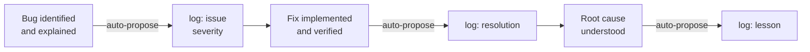
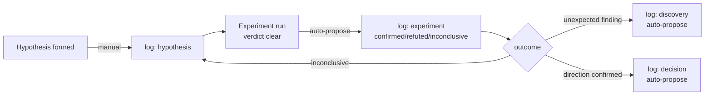

# ml-journal

A persistent, structured audit trail for Claude Code sessions. Captures decisions, issues, discoveries, experiments, and session state in a machine-queryable, append-only JSONL log — survives compaction and session boundaries.

ml-journal is **standalone** and works in any git repo. It pairs naturally with the `ml-lab` plugin for hypothesis-driven experiments, but does not require it.

## The Problem

Claude Code sessions are stateless. When context compacts or a new session starts, the reasoning trail disappears — decisions are made but not recorded, issues discovered in one session resurface as surprises later, post-mortems happen from memory, and handoffs require manual summaries that are never written. ml-journal is the persistent layer that fills this gap.

## Installation

**Via plugin (recommended):**

```bash
# Install the plugin (once, user-scoped)
claude plugin install ml-journal@ml-debate-lab

# Initialize in any git repo (once per repo)
/log-init
```

**Manual option 1 — copy the plugin directory into your repo:**

```bash
cp -r plugins/ml-journal /your/repo/plugins/ml-journal
```

Then register it in your repo's `.claude-plugin/marketplace.json` and run `claude plugin install ml-journal@your-repo`. Skills are auto-discovered from `plugins/ml-journal/skills/`.

**Manual option 2 — copy skills directly into `~/.claude/`:**

```bash
# Copy all skills into your global Claude Code skills directory
cp -r plugins/ml-journal/skills/* ~/.claude/skills/

# Copy the report-drafter agent
cp plugins/ml-journal/report-drafter.md ~/.claude/agents/
```

Skills copied to `~/.claude/skills/` are available globally across all repos without any plugin install step. Run `/log-init` in any repo to initialize the journal.

---

`/log-init` creates `.project-log/` at the repo root, copies the query scripts, and writes a verification entry.

## Architecture

```
judgment layer     →  Claude skills (extract, classify, construct args)
agent layer        →  Subagents (isolated context ingestion for heavy synthesis)
mechanical layer   →  Python scripts (validate, serialize, write)
storage            →  .project-log/journal.jsonl (per-repo, append-only)
```

No background daemons. No external dependencies beyond `python3` and `git` (`jq` only needed for hooks).

## Typical Workflow

```
During a session:
  /log-entry          ← log decisions, issues, discoveries as they happen
  /log-commit         ← commit + log in one step

End of session:
  /checkpoint         ← snapshot current state for next session
  /research-note      ← generate a shareable note from today's work (optional)

Next session:
  /resume             ← reload checkpoint into context

Periodic:
  /log-summarize      ← prose synthesis of a specific entry type
  /log-status         ← quick overview of the journal state
  /research-report    ← full retrospective at end of phase or project
```

## Chain Workflows

Proactive logging rules (injected into `CLAUDE.md` by `/log-init`) define how entry types chain together naturally during a session. Claude auto-proposes each step at the right moment — you confirm or decline.

### Bug Fix



### Investigation



### Session Boundary

```mermaid
flowchart LR
    A[Active session\nentries logged] -->|end of session| B[/checkpoint]
    B -->|optional| C[/research-note\nRESEARCH_NOTE_date.md]
    D[New session] -->|start of session| E[/resume]
    E --> F[Continue work]
    B -.->|persists across| D
```

### Synthesis Ladder

```mermaid
flowchart TB
    J[journal.jsonl] --> S[/log-summarize\nprose by type]
    S -->|reused as input| N[/research-note\nsession-scoped note]
    J -->|end of phase| R[/research-report\ndispatches report-drafter]
    R --> RP[RESEARCH_REPORT.md]
```

## Skills

| Skill | Description |
|---|---|
| `/log-init` | One-time repo setup — creates `.project-log/`, installs scripts, verifies with a test entry |
| `/log-entry` | Main logging path — infers entry type from conversation context, extracts fields, writes to journal |
| `/checkpoint` | Save session state for handoff to future sessions or post-compact recovery |
| `/resume` | Load and display the most recent checkpoint |
| `/log-status` | Quick overview — last checkpoint, entry counts, unresolved issues, recent commits |
| `/log-list` | List entries by type with optional time filter (`--since 7d`) |
| `/log-summarize` | Prose synthesis of all entries of a given type |
| `/log-commit` | Git commit + journal log in one step — separating the two breaks the audit trail (see note below) |
| `/research-note` | Generate a session or day-scoped formatted markdown note — shareable, PR-ready |
| `/research-report` | Synthesize `RESEARCH_REPORT.md` — dispatches `report-drafter` agent to read full journal + git history |

> **Why `/log-commit` instead of a plain `git commit`?** The journal's `git` entry type captures a `diff_summary` field — a 1–2 sentence prose description of *why* the commit exists, not just what changed. A commit message rarely has room for this. But the `diff_summary` is only useful if it's written at commit time, while the context is fresh. Separating commit from log means the `diff_summary` is never written, or written later from memory. `/log-commit` keeps them atomic.

### Synthesis: `/research-note` vs `/research-report`

Both skills synthesize from the journal, but serve different scopes and audiences:

| | `/research-note` | `/research-report` |
|---|---|---|
| **Scope** | Session or day | Full project or phase |
| **Output** | `RESEARCH_NOTE_<date>.md` (~40–80 lines) | `RESEARCH_REPORT.md` (comprehensive) |
| **Sections** | Summary, Key Decisions, Discoveries & Results, Issues, Current State, Next Steps | Problem Statement, Timeline, What Was Tried/Failed/Worked, Key Decisions, Issues and Resolutions, Open Questions |
| **Mechanism** | Runs inline from recent journal entries | Dispatches `report-drafter` subagent to isolate heavy context ingestion |
| **When to use** | After a work session, before a PR, daily update | End of phase or project, onboarding a new collaborator |

Use `/research-note` for sharing what happened today. Use `/research-report` for a complete retrospective.

## Agents

| Agent | Dispatched by | Description |
|---|---|---|
| `report-drafter` | `/research-report` | Reads full journal, git history, and supplementary docs; synthesizes 9-section draft. Never writes files. |

## Entry Types

| Type | Required Fields | Confirm? | Weight |
|---|---|---|---|
| `issue` | description, severity¹ | No | Light |
| `resolution` | description | No | Light |
| `discovery` | description | Yes | Medium |
| `hypothesis` | description | Yes | Medium |
| `lesson` | description | No | Light |
| `memo` | description | No | Light |
| `decision` | description, rationale | Yes | Medium |
| `experiment` | description, verdict² | Yes | Medium |
| `summary` | description | Yes | Medium |
| `post_mortem` | description, what_failed, root_cause | Yes | Heavy |
| `checkpoint` | in_progress | Yes | Heavy |
| `git` | commit_hash, message, branch | Yes (via `/log-commit`) | — |

¹ `severity` must be one of: `low`, `moderate`, `high`, `critical`
² `verdict` must be one of: `confirmed`, `refuted`, `inconclusive`

Light entries are logged immediately. Medium entries (including discoveries and hypotheses) show a draft and ask for confirmation before writing. Heavy entries do the same.

## Scripts

Both scripts are stdlib-only Python (no external dependencies). They are installed into `.project-log/` by `/log-init` and can be invoked directly.

- **`journal_log.py`** — Validates fields, constructs envelope (`id`, `timestamp`, `type`, `project`, `session_id`), appends entry to `journal.jsonl`
- **`journal_query.py`** — Read operations: `--status`, `--latest-checkpoint`, `--list TYPE [--since Nd]`, `--unresolved-issues`, `--entry ID_PREFIX`

The journal is a plain JSONL file — one JSON object per line. Query it directly without any skill:

```bash
# Show journal state
python3 .project-log/journal_query.py --status

# List decisions from the last week
python3 .project-log/journal_query.py --list decision --since 7d

# List all unresolved issues
python3 .project-log/journal_query.py --unresolved-issues

# Pipe to jq for custom queries
python3 .project-log/journal_query.py --list experiment | jq '.[] | {description, verdict}'
```

## Example Output

```
/log-status output:
  Last checkpoint: 2026-04-09 10:14 (3h ago) — in_progress: refining case scoring rubric
  Entries this session: 2 decisions, 1 experiment, 1 issue
  Unresolved issues: 1 [high]
  Recent commits: 3

/resume output:
  in_progress:         refining case scoring rubric
  pending_decisions:   whether to weight IDJ separately from must_find
  recently_completed:  Phase 7 cross-vendor scoring run
  open_threads:        baseline ceiling effect, rubric alignment with v4
```

## Hooks (Optional)

Two hook scripts enable automatic checkpoint/resume without manual invocation.

| Hook | Script | Behavior |
|---|---|---|
| PreCompact | `journal-precompact.sh` | Auto-writes a checkpoint before `/compact` |
| SessionStart | `journal-session-start.sh` | Injects latest checkpoint as session context |

To enable, add to `.claude/settings.local.json` (per-machine, gitignored):

```json
{
  "hooks": {
    "PreCompact": [{ "type": "command", "command": "bash plugins/ml-journal/journal-precompact.sh" }],
    "SessionStart": [{ "type": "command", "command": "bash plugins/ml-journal/journal-session-start.sh" }]
  }
}
```

**Gotchas:**
- Hooks are per-machine — `.claude/settings.local.json` is gitignored and does not sync to teammates. Each developer must configure separately.
- `SessionStart` only injects a checkpoint if one exists. The first session in a new repo will see no injection.
- If your Claude Code environment does not permit hooks, use skills explicitly instead (`/checkpoint` before `/compact`, `/resume` at session start).

## Troubleshooting

**"No journal found. Run `/log-init` first."** — Run `/log-init` in the repo root. The `.project-log/` directory does not yet exist.

**Entries seem missing** — Check that `.project-log/journal.jsonl` is committed and not listed in `.gitignore`. The journal should be tracked, not ignored.

**`journal_query.py` skips a line with a warning** — A journal entry is malformed (e.g., manually edited). Malformed lines are skipped; all other entries remain accessible. Inspect with `grep -n "^{" .project-log/journal.jsonl | tail -20` to find the bad line.

**Hooks don't fire** — Confirm your Claude Code environment supports hooks and that `.claude/settings.local.json` exists on the current machine with the correct paths.

## Files

```
plugins/ml-journal/
  .claude-plugin/
    plugin.json                   # plugin manifest
  skills/
    log-init/
      SKILL.md
      scripts/
        journal_log.py            # bundled copy — installed into .project-log/ on /log-init
        journal_query.py
    log-entry/SKILL.md
    checkpoint/SKILL.md
    resume/SKILL.md
    log-status/SKILL.md
    log-list/SKILL.md
    log-summarize/SKILL.md
    log-commit/SKILL.md
    research-note/SKILL.md
    research-report/SKILL.md
  report-drafter.md               # agent — drafts RESEARCH_REPORT.md (dispatched by /research-report)
  journal_log.py                  # top-level copy (used at runtime from .project-log/)
  journal_query.py
  journal-precompact.sh           # optional PreCompact hook
  journal-session-start.sh        # optional SessionStart hook
  journal_system_spec.md          # internal system specification
```
