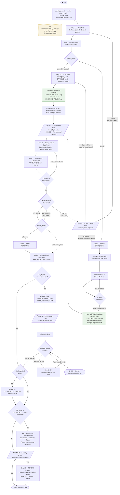

# ml-lab Investigation Flow

```mermaid
flowchart TD
    START(["▶ Start"]) --> PRE["Ask: hypothesis · metrics · report_mode · review_mode<br/>Write HYPOTHESIS.md"]

    PRE ~~~ LOG["📋 INVESTIGATION_LOG.jsonl<br/>uv run log_entry.py throughout all steps"]
    style LOG fill:#f9f3e0,stroke:#c9a227,stroke-dasharray: 5 5

    PRE --> S1["Step 1 — Build PoC<br/>Reference check · Explicit params"]
    S1 --> S2["Step 2 — Clarify Intent<br/>Write README.md"]

    S2 --> RMODE{"review_mode?"}

    RMODE -- "ensemble (default)" --> ENS_S3["Step 3 — 3× ml-critic<br/>CRITIQUE_1.md · CRITIQUE_2.md · CRITIQUE_3.md"]
    ENS_S3 --> ENS_AGG["Step 3A — Aggregate Findings<br/>Cluster by root cause · Tag confidence tiers<br/>ENSEMBLE_REVIEW.md"]
    ENS_AGG --> PREFLIGHT_E["Extract issues by tier · Propose empirical tests<br/>Build pre-flight checklist"]
    style ENS_AGG fill:#e8f4e8,stroke:#2e7d32

    RMODE -- "debate" --> S3["Step 3 — ml-critic<br/>CRITIQUE.md"]
    S3 --> S4["Step 4 — ml-defender<br/>DEFENSE.md · log verdict"]
    S4 --> DROUND["Debate Round N<br/>Critic ↔ Defender"]
    DROUND --> DRES{"All points<br/>resolved?"}
    DRES -- "No · rounds left" --> DROUND
    DRES -- "Yes or max 4 reached" --> PREFLIGHT_D
    PREFLIGHT_D["Parse DEFENSE.md Pass 2 verdict table<br/>Extract concessions + pre-execution requirements<br/>Build pre-flight checklist"]
    style PREFLIGHT_D fill:#e8f4e8,stroke:#2e7d32

    PREFLIGHT_E --> G1
    PREFLIGHT_D --> G1

    G1[/"✋ Gate 1 — Experiment Plan<br/>All pre-flight items CLOSED · User approval required"/]

    G1 --> S6["Step 6 — Design & Run Experiment<br/>Baseline verification · Precondition check"]
    S6 --> S7["Step 7 — Synthesize Conclusions<br/>CONCLUSIONS.md + figures"]
    S7 --> MFLAW{"Evaluation<br/>design flaw?"}
    MFLAW -- "Yes → micro-iterate" --> S6

    MFLAW -- "No" --> MACRO{"Macro-iteration<br/>Outcome?"}
    MACRO -- "A: Proceed" --> RPT_MODE
    MACRO -- "Cap reached<br/>(3 cycles)" --> RPT_MODE
    MACRO -- "B or C<br/>under cap" --> G2

    G2[/"✋ Gate 2 — Re-Opening Plan<br/>User approval required"/]
    G2 -- "B ensemble:<br/>re-run 3× critic Mode 3" --> ENS_S3
    G2 -- "B debate:<br/>return to adversarial review" --> S3
    G2 -- "C: revise<br/>hypothesis + PoC" --> S1

    RPT_MODE{"report_mode?"}
    RPT_MODE -- "full_report" --> S8["Step 8 — Write REPORT.md"]
    RPT_MODE -- "conclusions_only" --> S9
    S8 --> S9["Step 9 — Production Re-evaluation<br/>REPORT_ADDENDUM.md"]

    S9 --> PRGATE{"full_report<br/>+ run peer review?"}
    PRGATE -- "No" --> S11GATE
    PRGATE -- "Yes" --> R1["Step 10 Round 1<br/>research-reviewer · Opus<br/>PEER_REVIEW_R1.md"]
    R1 --> G3[/"✋ Gate 3 — Remediation Plan<br/>User approval required"/]
    G3 --> FIX["Address findings"]
    FIX --> PRCHK{"MAJOR issues<br/>remain?"}
    PRCHK -- "No · converged" --> S11GATE
    PRCHK -- "Yes · rounds left" --> R23["Rounds 2–3<br/>research-reviewer-lite · Haiku"]
    R23 --> PRCHK
    PRCHK -- "Yes · max 3 rounds" --> HALT(["⛔ Halt — Human intervention required"])

    S11GATE{"Final technical<br/>report?"}
    S11GATE -- "Yes" --> S11["Step 11 — TECHNICAL_REPORT.md<br/>Results mode"]
    S11GATE -- "No" --> S12GATE
    S11 --> S12GATE

    S12GATE{"full_report or<br/>TECHNICAL_REPORT<br/>produced?"}
    S12GATE -- "No" --> S13GATE
    S12GATE -- "Yes" --> S12["Step 12 — Artifact Coherence Audit<br/>6 cross-doc consistency checks<br/>Fix any inconsistency before exit"]
    S12 --> S13GATE

    S13GATE[/"❓ README readability review?<br/>User confirmation required"/]
    S13GATE -- "No" --> DONE
    S13GATE -- "Yes" --> S13["Step 13 — README Rewrite<br/>readme-rewriter · outside reader<br/>diagnose → outline → rewrite"]
    S13 --> DONE(["✓ Final Output to Caller"])
```
