# ml-journal

### Persistent Session Audit Trail for Claude Code

&nbsp;

**Every decision, issue, and experiment — captured in a machine-queryable log that survives compaction and session boundaries.**

&nbsp;

*A Claude Code plugin — install once, use in any git repo*

---

# The Problem with Ephemeral Sessions

Claude Code sessions are stateless. When the context compacts or a new session starts, the reasoning trail disappears.

- **Decisions are made but not recorded** — future sessions re-litigate the same tradeoffs
- **Issues discovered in one session go untracked** — they resurface as surprises later
- **Post-mortems happen from memory** — incomplete, biased toward recent events
- **Handoff between sessions requires manual summaries** — which are never written

<div class="hero">
<strong>Result:</strong> Teams run the same failed experiment twice, lose the rationale behind architectural choices, and can't reconstruct what actually happened during an investigation.
</div>

---

# What ml-journal Is

A Claude Code plugin that maintains a **structured, append-only JSONL audit trail** for every session — with ten skills for logging, querying, and synthesizing the record.

| Layer | Component | Role |
|-------|-----------|------|
| **Judgment** | Claude skills | Extract, classify, construct log arguments from conversation |
| **Mechanical** | Python scripts | Validate fields, serialize, append to journal |
| **Storage** | `.project-log/journal.jsonl` | Per-repo, append-only, machine-queryable |

No background daemons. No external dependencies beyond `python3` and `git`.

<div class="hero">
<strong>Install:</strong> <code>/plugin install claude-ml-journal@ml-debate-lab</code> then <code>/log-init</code> in any git repo.
</div>

---

# Ten Skills, Two Jobs

Skills split cleanly into **write** (add to the journal) and **read** (query and synthesize).

| Skill | Job | Direction |
|-------|-----|-----------|
| `/log-entry` | Log a typed entry from conversation context | Write |
| `/log-commit` | Git commit + journal log in one step | Write |
| `/checkpoint` | Save session state for handoff or post-compact recovery | Write |
| `/resume` | Load and display the most recent checkpoint | Read |
| `/log-status` | Quick overview — counts, unresolved issues, recent commits | Read |
| `/log-list` | List entries by type with optional time filter | Read |
| `/log-summarize` | Prose synthesis of all entries of a given type | Read |
| `/log-init` | One-time repo setup | Setup |
| `/research-note` | Session/day-scoped formatted note — shareable, PR-ready | Synthesis |
| `/research-report` | Synthesize `RESEARCH_REPORT.md` from full journal + git history | Synthesis |

---

# Entry Types

ml-journal enforces a fixed schema per entry type. Claude infers the type from conversation context — you don't have to label it.

| Type | Required Fields | Confirm? |
|------|----------------|----------|
| `issue` | description, severity | No |
| `resolution` | description | No |
| `decision` | description, rationale | Yes |
| `discovery` | description | No |
| `hypothesis` | description | No |
| `experiment` | description, verdict | Yes |
| `post_mortem` | description, what_failed, root_cause | Yes |
| `checkpoint` | in_progress | Yes |
| `git` | commit_hash, message, branch | Yes (via `/log-commit`) |

High-stakes types (decisions, experiments, post-mortems) require confirmation before writing.

---

# Logging an Entry

`/log-entry` reads the conversation, infers type and fields, and writes to the journal.

**Example — logging a decision:**
```
You: We decided to use cosine similarity over Euclidean distance because
     the embedding magnitudes vary by document length. Log this.

ml-journal: decision | "Use cosine similarity for document embeddings"
            Rationale: embedding magnitudes vary by document length,
                       making Euclidean distance unreliable.
            ► Log this entry? (y/n)
```

**What gets written:**
```json
{"id": "a3f2...", "type": "decision", "timestamp": "2026-04-09T06:00:00Z",
 "description": "Use cosine similarity for document embeddings",
 "rationale": "embedding magnitudes vary by document length"}
```

---

# Committing and Logging in One Step

`/log-commit` stages, commits, and writes a `git` journal entry — all from a single command.

```
You: /log-commit
```

ml-journal:
1. Runs `git status` and `git diff --stat HEAD` — shows you what will be committed
2. Synthesizes a commit message from conversation context
3. Proposes a `git` journal entry with `diff_summary`
4. Asks for confirmation
5. Commits, captures the hash, logs to journal

<div class="hero">
<strong>Why one step?</strong> Separating commit from log breaks the audit trail. The journal entry captures the <em>why</em> (diff_summary) that the commit message doesn't have room for — but only if they happen together.
</div>

---

# Session Handoff: Checkpoint and Resume

The two highest-value skills for multi-session work.

**`/checkpoint`** — saves current session state before a `/compact` or end of session:
- What's in progress
- What's blocked and why
- What the next action is
- Key decisions made this session

**`/resume`** — loads the latest checkpoint at the start of a new session:
- Surfaces the in-progress state directly into context
- No manual summary required
- Works across compactions — the checkpoint survives even if the conversation doesn't

<div class="hero">
<strong>Pattern:</strong> Run <code>/checkpoint</code> before every <code>/compact</code>. Run <code>/resume</code> at the start of every session. The journal becomes the session memory that Claude Code doesn't have natively.
</div>

---

# Querying the Record

Three read skills for different levels of detail.

**`/log-status`** — quick dashboard:
```
Last checkpoint: 2026-04-09 06:00 | "Finishing Phase 3 scoring"
Entries this session: 4 decisions, 2 issues, 1 experiment
Unresolved issues: 2
Recent commits: fix: scorer bug in phase_score.py
```

**`/log-list issue --since 7d`** — enumerate recent entries of a type

**`/log-summarize decision`** — prose synthesis across all decisions:
> *"Three architectural decisions shaped the pipeline: cosine similarity was chosen over Euclidean distance due to magnitude variance, concurrent execution was adopted after sequential execution proved too slow, and the validation gate was tightened after two false-positive smoke tests."*

---

# Research Note vs. Research Report

Two synthesis skills for different audiences and scopes.

**`/research-note`** — session or day scoped, shareable
- Draws from recent journal entries (or an existing `log-summarize` output)
- Produces `RESEARCH_NOTE_<date>.md` — 40–80 lines
- Sections: Summary, Key Decisions, Discoveries & Results, Issues, Current State, Next Steps
- Use after a work session, before a PR, or to share a daily update

**`/research-report`** — full project or phase scope
- Dispatches `report-drafter` subagent to isolate heavy context ingestion from the main session
- Draws from all journal entries, full `git log`, and supplementary markdown files
- Produces `RESEARCH_REPORT.md` — comprehensive retrospective
- Sections: Problem Statement, Timeline, What Was Tried/Failed/Worked, Key Decisions, Issues and Resolutions, Open Questions
- Use at end of phase or project, or to onboard a new collaborator

---

# Chain Workflows — Bug Fix & Investigation

Proactive logging rules chain entry types together. Claude proposes each step at the right moment.

**Bug fix** — three entries, one event chain:


**Investigation** — hypothesis → experiment → outcome:



---

# Chain Workflows — Session & Synthesis

**Session boundary** — state survives compaction:



**Synthesis ladder** — from raw entries to shareable artifacts:



---

# Optional Hooks

Two hook scripts enable automatic checkpoint/resume without manual invocation.

| Hook | Script | Behavior |
|------|--------|----------|
| `PreCompact` | `journal-precompact.sh` | Auto-writes a checkpoint before `/compact` |
| `SessionStart` | `journal-session-start.sh` | Injects latest checkpoint as session context |

To enable, add to `.claude/settings.local.json` (per-machine, gitignored):

```json
{
  "hooks": {
    "PreCompact": [{ "type": "command",
      "command": "bash plugins/ml-journal/journal-precompact.sh" }],
    "SessionStart": [{ "type": "command",
      "command": "bash plugins/ml-journal/journal-session-start.sh" }]
  }
}
```

Hooks are not registered by default — install only if your environment permits them.

---

# When to Use ml-journal

**Use ml-journal when:**
- You run multi-session investigations and need context to survive compaction
- You make architectural decisions that future sessions will need to understand
- You want a reconstructable audit trail for post-mortems or research narratives
- You're using ml-lab and want decisions and experiment outcomes logged alongside git history

**You get the most value from:**
- `/log-commit` as a commit habit — git + journal in every commit
- `/checkpoint` before every `/compact`
- `/resume` at the start of every session
- `/log-summarize` before a post-mortem to reconstruct what happened

<div class="hero">
<strong>Works well with ml-lab:</strong> ml-lab generates decisions, discoveries, and experiment outcomes — ml-journal captures them. Run both plugins together for a complete investigation record.
</div>
